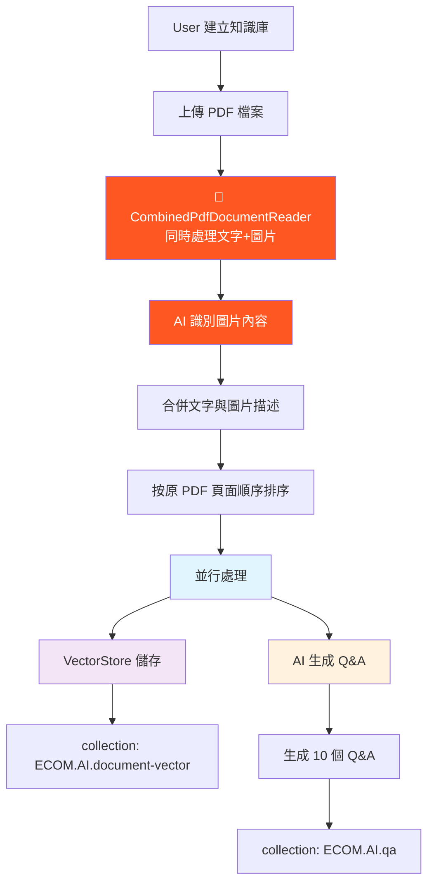
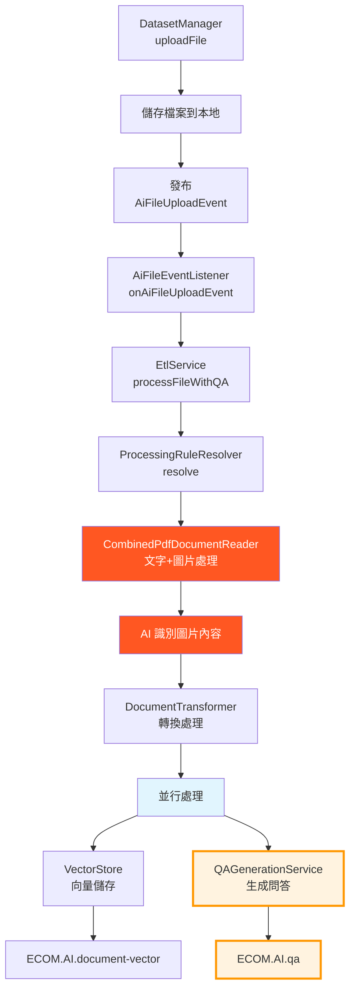

專案架構總覽
這是一個基於 Spring Boot 3.x 的智能客服助手系統，整合 RAG（檢索增強生成）技術，提供企業級的 AI 問答服務。採用多模組 Maven 架構設計。
模組架構
📦 ecom-assistant (多模組 Maven 架構)
├── 🌐 ecom-assistant-api      # REST API 控制器與 Web 配置 (應用程式入口點)
├── 🧠 ecom-assistant-core     # 核心業務邏輯與服務，依賴所有其他模組
├── 🗄️ ecom-assistant-db       # 資料庫實體、Repository 與資料服務 (Couchbase)
├── 🤖 ecom-assistant-ai       # AI 相關服務，包括 ETL、文件處理與 Spring AI 整合
└── 📋 ecom-assistant-common   # 共用資源、DTO 與常用工具
重要設計原則：

除了 core 模組外，其他模組互不依賴
資料庫實體保留在 db 模組，common 模組的 DTO 透過 MapStruct 轉換
業務邏輯與資料存取分離

核心技術堆疊

語言 & 框架: Java 21 + Spring Boot 3.4.5
資料庫: Couchbase 7.6.5 (統一資料庫/快取/向量儲存)
AI 服務: Spring AI + OpenAI GPT-4 / Groq
安全認證: Spring Security + JWT + Apache Shiro
文件處理: Apache PDFBox + Spring AI ETL
建置工具: Maven 3.9.6
實體映射: MapStruct
容器化: Docker + Multi-platform

認證與授權

基於 JWT 的認證搭配 Apache Shiro realm
基於角色的存取控制與團隊成員身份
資料集層級的權限系統
透過 @CurrentUserId 解析當前使用者上下文

開發環境設定
必要工具

Java 21+
Docker & Docker Compose
Maven 3.9+

建置與執行
```bash
# 建置整個專案
mvn clean install

# 執行應用程式（從根目錄）
mvn spring-boot:run -pl ecom-assistant-api

# 建置 Docker 映像
docker build -f docker/Dockerfile -t ecom-assistant .

# 多平台建置（Apple Silicon）
docker buildx build --platform linux/amd64,linux/arm64 -t willyliang/ecom-assistant:latest .
```
環境設定

環境配置：
```bash
cp .env.example .env
# 編輯 .env 設定：
# - Couchbase 連接詳細資訊
# - OpenAI API 金鑰用於嵌入
# - Groq API 金鑰用於聊天（可選）
```

啟動 Couchbase：
```bash
docker run -d --name couchbase-ai --hostname couchbase.local \
  --add-host couchbase.local:127.0.0.1 \
  -p 8091-8097:8091-8097 -p 9123:9123 -p 11210:11210 \
  -p 11280:11280 -p 18091-18097:18091-18097 \
  couchbase:enterprise-7.6.5
```

初始化資料庫：
```bash
# 從 .env 配置生成架構檔案
bash generate_schema.sh

# 複製 schema 檔案到容器
docker cp schema_generated/. couchbase-ai:/tmp/schema/

# 執行自動化初始化腳本
bash schema_generated/init_couchbase.sh
```


測試
```bash
# 執行所有測試
mvn test

# 執行特定模組的測試
mvn test -pl ecom-assistant-core

# 建置時跳過測試
mvn clean install -DskipTests

# 執行單一測試類別
mvn test -Dtest=ChatServiceTest -pl ecom-assistant-core
```
資料庫架構
Couchbase Collections
```
📁 ECOM (Bucket)
└── 📂 AI (Scope)
    ├── 📄 document          # 文件儲存
    ├── 📄 dataset           # 知識庫管理
    ├── 📄 qa                # 📝 Q&A 問答資料 (新增)
    ├── 📄 chat-topic        # 聊天主題
    ├── 📄 chat-record       # 聊天記錄
    ├── 📄 chat-message      # 聊天訊息
    ├── 📄 document-vector   # 向量嵌入
    ├── 📄 user              # 使用者帳號
    ├── 📄 team              # 團隊管理
    ├── 📄 team-membership   # 團隊成員關係
    ├── 📄 team-role         # 團隊角色
    ├── 📄 system-role       # 系統角色
    └── 📄 cache             # 快取
```

預設測試帳號

| 使用者 | 密碼 | 角色 | 說明 |
|--------|------|------|------|
| super_admin | super_admin | SUPER_ADMIN | 系統超級管理員 |
| user_admin | user_admin | USER_ADMIN | 使用者管理員 |
| team_admin | team_admin | TEAM_ADMIN | 團隊管理員 |
手動架構執行順序
如需手動執行 schema：

1. `01_scopes.sql` - 建立作用域
2. `02_collections.sql` - 建立集合
3. `03_data_*.sql` 檔案 - 初始資料
4. `04_indexes.sql` - 建立索引

文件處理與 AI 整合
目前文件處理流程

增強的 PDF 處理架構

CombinedPdfDocumentReader: 處理整個文件，保持頁面順序，支援混合文字+圖片內容
DefaultPagePdfDocumentReader: 傳統的逐頁處理（備用）
透過 etl.file-processing.default.reader 配置控制切換
預設使用 combinedPdfDocumentReader 進行增強處理

ETL 處理流程詳解

AI 驅動的問答增強系統
Q&A 資料結構
```json
{
  "id": "qa_<dataset_id>_<document_id>_<timestamp>",
  "datasetId": "dataset123",
  "documentId": "doc456", 
  "documentName": "產品手冊.pdf",
  "question": "此產品的主要功能是什麼？",
  "answer": "根據文件內容，此產品的主要功能包括...",
  "questionIndex": 1,
  "createdAt": "2024-07-27T10:30:00Z",
  "_class": "com.ecom.ai.ecomassistant.db.model.QAPair"
}
```
問答生成流程

檔案上傳流程: AiFileEventListener → EtlService.processFileWithQA() → QAGenerationService
問答生成: 使用 OpenAI 從整個文件內容生成 10 個綜合問答對
儲存: 問答對儲存到 ECOM.AI.qa 集合，包含元資料（datasetId、documentName、questionIndex）
配置: 可透過 FileProcessingRuleConfig 配置（預設：combinedPdfDocumentReader）

核心服務架構
重要服務

ChatService (ecom-assistant-core): 核心聊天功能，支援 RAG 與串流
AiChatController (ecom-assistant-api): 主要聊天 API 控制器（取代已棄用的 ChatController）
QAGenerationService (ecom-assistant-ai): AI 問答生成服務
DynamicToolService (ecom-assistant-core): 工具註冊與執行
PermissionService (ecom-assistant-core): 授權檢查
EtlService (ecom-assistant-ai): 文件處理管道
DatasetService (ecom-assistant-db): 資料集管理

關鍵模式

工具系統: 透過 @ChatToolMarker 註解進行動態工具註冊
權限系統: 使用 PermissionDefinition 和 PermissionRegistry 的宣告式權限
事件驅動: 檔案上傳事件觸發 AI 處理管道
ETL 管道: 可配置的文件讀取器和轉換器用於 AI 處理

配置

主要配置: ecom-assistant-api/src/main/resources/application.yaml
環境變數: 處理敏感資料（API 金鑰、資料庫憑證）
檔案上傳: 目錄可透過 FILE_UPLOAD_DIR 配置

關鍵實作注意事項
異步處理上下文

問答生成透過 AiFileEventListener 上的 @Async 在異步上下文中執行
QAPair 實體不繼承 AuditableDocument 以避免 Spring Security 上下文問題
使用手動時間戳管理而非 Spring Data Auditing
所有異步操作都需要適當的錯誤處理和日誌記錄

模組依賴關係與設計

除 core 模組外，其他模組不可互相依賴
ecom-assistant-ai 依賴 ecom-assistant-db 進行問答儲存
QAGenerationService 必須在 ai 模組中（非 core）以存取 db 服務
資料庫實體保留在 db 模組，DTO 在 common 模組透過 MapStruct 映射

PDF 處理特殊要求

檔案處理需要保持原始順序，特別是 PDF 的頁面順序
支援混合文字+圖片內容提取
圖片內容透過 AI 識別並整合到文字中
向量儲存和 Q&A 生成需要並行執行，提高處理效率

權限控制實作

使用 @CurrentUserId 注解取得當前使用者
權限檢查使用 @PermissionRequired 注解
透過 PermissionUtil 進行程式化權限檢查
支援系統級 → 團隊級 → 資源級的三層權限架構

AI 整合詳解
聊天系統

Spring AI 整合，支援可配置的提供者（OpenAI/Groq）
透過 Couchbase 聊天歷史進行記憶管理
支援工具調用，自定義工具在 customtools/ 套件中
RAG 檢索基於向量相似度的文件檢索
多輪對話支援上下文記憶

文件處理能力

多格式支援: PDF、CSV、JSON 文件處理
圖片提取: PDF 中的圖片內容 AI 識別
向量化: 文件自動切分與向量嵌入
批次處理: 非同步文件處理管道
問答生成: 每個文件自動生成 10 個問答對

API 文件與測試
Swagger UI
啟動服務後訪問：http://localhost:8080/swagger-ui/index.html
主要 API 端點

認證: POST /auth/login
聊天對話: POST /api/v1/ai/chat/topics/{topicId}/ask (SSE 串流)
知識庫管理: POST /datasets/{id}/upload (檔案上傳)
聊天主題: GET /api/v1/ai/chat/topics (查詢聊天主題)
Q&A 查詢: 透過向量搜尋或直接查詢 qa 集合

開發除錯

所有核心功能都有完整的日誌記錄
使用 @Slf4j 進行統一日誌管理
異步處理包含詳細的錯誤追蹤
Couchbase 查詢可透過 Web Console 監控

故障排除
常見問題

Couchbase 連接失敗: 檢查容器狀態和端口開放
OpenAI API 錯誤: 確認 API Key 和網路連接
檔案處理失敗: 檢查檔案格式和大小限制
異步處理問題: 查看 Spring 異步配置和執行緒池設定

日誌配置
yamllogging:
  level:
    com.ecom.ai: DEBUG
    org.springframework.ai: DEBUG
    org.springframework.data.couchbase: DEBUG
📋 目前預計修改項目清單
🎯 主要目標
優化 PDF 文件處理流程，實現文字+圖片的完整內容提取，並增加自動問答生成功能。
📝 具體修改項目
1. 資料庫架構更新

 新增 QA Collection:

檔案: schema/02_collections.sql
新增: CREATE COLLECTION ECOM.AI.qa IF NOT EXISTS;
用途: 儲存自動生成的問答對


2. 資料模型建立

 建立 QAPair 實體:

新檔案: ecom-assistant-db/src/main/java/com/ecom/ai/ecomassistant/db/model/QAPair.java
欄位: id, datasetId, documentId, documentName, question, answer, questionIndex, createdAt
注意: 不繼承 AuditableDocument 以避免異步上下文問題


 建立 QAPair Repository:

新檔案: ecom-assistant-db/src/main/java/com/ecom/ai/ecomassistant/db/repository/QAPairRepository.java
包含基本 CRUD 和按 datasetId 查詢方法


 建立 QAPair Service:

新檔案: ecom-assistant-db/src/main/java/com/ecom/ai/ecomassistant/db/service/QAPairService.java
繼承 CrudService<QAPair, String, QAPairRepository>


3. AI 服務實作

 實作 QAGenerationService:

新檔案: ecom-assistant-ai/src/main/java/com/ecom/ai/ecomassistant/ai/service/QAGenerationService.java
功能: 從文檔內容生成 10 個問答對
使用 OpenAI API 進行問答生成
支援異步處理


4. ETL 流程修改

 修改 EtlService 支援問答生成:

檔案: ecom-assistant-ai/src/main/java/com/ecom/ai/ecomassistant/ai/service/EtlService.java
新增: processFileWithQA() 方法
實作並行處理：向量儲存 + 問答生成


 更新 AiFileEventListener:

檔案: ecom-assistant-core/src/main/java/com/ecom/ai/ecomassistant/event/listener/AiFileEventListener.java
修改: onAiFileUploadEvent() 方法調用新的處理流程
確保異步上下文正確處理


5. PDF Reader 優化（如需要）

 驗證 CombinedPdfDocumentReader 功能:

檔案: 現有的 PDF reader 實作
確認: 文字+圖片處理是否符合需求
如不足，則需要按照原計畫重寫 PDF reader


6. 配置檔案更新

 更新 ETL 配置:

檔案: ecom-assistant-ai/src/main/resources/application.yaml 或 FileProcessingRuleConfig
確認: etl.file-processing.default.reader 指向正確的 reader
新增: QA 生成相關配置參數


7. API 端點擴充（可選）

 新增 QA 查詢 API:

新檔案: ecom-assistant-api/src/main/java/com/ecom/ai/ecomassistant/controller/QAController.java
端點: GET /api/v1/qa/dataset/{datasetId} - 查詢指定資料集的問答
端點: GET /api/v1/qa/document/{documentId} - 查詢指定文檔的問答


8. 測試與驗證

 單元測試:

QAGenerationServiceTest - 測試問答生成功能
EtlServiceTest - 測試修改後的 ETL 流程
QAPairServiceTest - 測試問答資料存取


 整合測試:

完整的檔案上傳 → 處理 → 問答生成流程測試
驗證向量儲存和問答生成並行執行
確認資料正確儲存到對應 Collection


🔧 實作優先順序
Phase 1: 基礎架構 (高優先級)

資料庫架構更新 (QA Collection)
資料模型建立 (QAPair 相關)
QAGenerationService 基本實作

Phase 2: 核心功能 (高優先級)

ETL 流程修改支援並行處理
AiFileEventListener 更新

Phase 3: 優化與擴充 (中優先級)

PDF Reader 功能驗證/優化
配置檔案更新
API 端點擴充

Phase 4: 測試與完善 (中優先級)

單元測試撰寫
整合測試執行
錯誤處理完善

⚠️ 注意事項

異步處理: 確保在異步上下文中正確處理 Spring Security 和資料庫連接
錯誤處理: 所有新增功能都需要完善的異常處理和日誌記錄
效能考量: 問答生成可能耗時，確保不影響檔案上傳的回應時間
資源管理: AI API 調用需要適當的限流和重試機制
向後相容: 確保現有功能不受影響

🎯 最終目標驗證
完成所有修改後，系統應能實現：

✅ 上傳 PDF → 同時提取文字和圖片內容
✅ 保持原 PDF 頁面順序
✅ 並行執行：向量儲存 + 問答生成
✅ 自動生成 10 個相關問答對
✅ 問答對包含正確的標籤和元資料
✅ 支援透過 API 查詢生成的問答

這份完整的 CLAUDE.md 文檔為 Claude Code 提供了專案的全面理解，包括架構設計、開發流程、關鍵實作細節，以及具體的實作清單和故障排除指引。