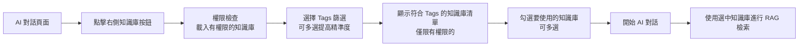
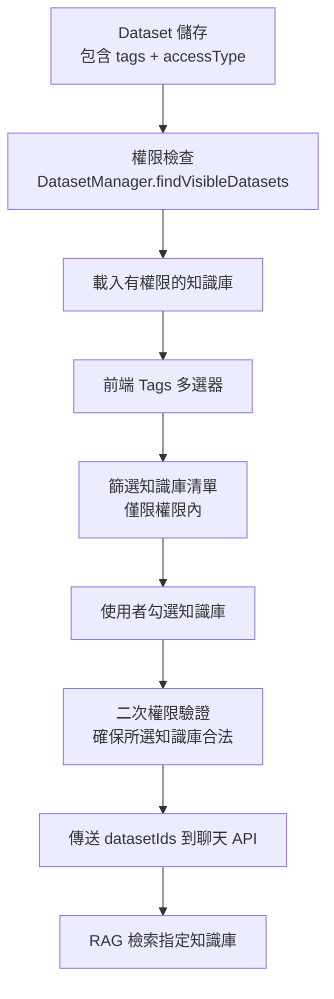

# Dataset Tags 系統實作規劃

## 📋 專案目標

實現基於 Tags 的知識庫篩選系統，讓用戶在 AI 對話時能精準選擇知識庫來源：
- 每個知識庫最多設置 3 個 tags
- AI 對話時可多選 tags 來篩選知識庫
- 篩選後勾選具體知識庫作為問答來源
- 完整的前後端 API 整合

---

## 🎯 核心概念設計

### Tags 系統設計
```
知識庫 Tags 體系：
• 每個知識庫最多 3 個 tags
• Tags 例子：
  - 技術類：React, TypeScript, API, 後端, 前端, 資料庫
  - 業務類：用戶手冊, 操作指南, FAQ, 政策, SOP
  - 產品類：功能介紹, 更新日誌, 規格說明
  - 其他：培訓, 文檔, 範例
```

### 權限控制設計
```
知識庫權限體系（與知識庫管理頁面完全一致）：
• PUBLIC：所有用戶可見
• GROUP：特定團隊成員可見（通過 authorizedTeamIds）
• PRIVATE：只有創建者可見

對話頁面知識庫選擇器必須：
• 使用與 DatasetManager.findVisibleDatasets() 相同的權限邏輯
• 確保用戶只能看到有權限的知識庫
• 支援系統管理員查看所有知識庫
```

### 使用者流程設計


### 資料流設計


---

## 🏗️ 後端修改清單

### 1. 資料庫模型層 (DB Layer)

#### 1.1 Dataset 實體修改
**檔案**: `ecom-assistant-db/src/main/java/com/ecom/ai/ecomassistant/db/model/Dataset.java`

**修改內容**:
```java
@Getter
@Setter
@Document
@Collection("dataset")
public class Dataset extends AuditableDocument {
    // ... 現有欄位保持不變

    // 新增 Tags 欄位（最多 3 個）
    private Set<String> tags = new HashSet<>();
    
    // 驗證 tags 數量的方法
    public void setTags(Set<String> tags) {
        if (tags != null && tags.size() > 3) {
            throw new IllegalArgumentException("Dataset 最多只能設置 3 個 tags");
        }
        this.tags = tags != null ? tags : new HashSet<>();
    }
}
```

#### 1.2 Repository 層擴展
**檔案**: `ecom-assistant-db/src/main/java/com/ecom/ai/ecomassistant/db/repository/DatasetRepository.java`

**新增方法**:
```java
public interface DatasetRepository extends CrudRepository<Dataset, String> {
    // ... 現有方法
    
    // 按 tags 查詢有權限的知識庫（結合權限檢查）
    @Query("SELECT * FROM #{#n1ql.bucket}.`#{#n1ql.scope}`.`#{#n1ql.collection}` " +
           "WHERE _class = 'com.ecom.ai.ecomassistant.db.model.Dataset' " +
           "AND ANY tag IN tags SATISFIES tag IN $tags END " +
           "AND (accessType = 'PUBLIC' " +
           "OR (accessType = 'GROUP' AND ANY g IN authorizedTeamIds SATISFIES g IN $userTeamIds END) " +
           "OR (accessType = 'PRIVATE' AND createdBy = $userId))")
    List<Dataset> findVisibleDatasetsByTags(List<String> tags, String userId, Set<String> userTeamIds);
    
    // 查詢所有有權限知識庫的 tags
    @Query("SELECT DISTINCT FLATTEN_KEYS(tags, 1) as tag FROM #{#n1ql.bucket}.`#{#n1ql.scope}`.`#{#n1ql.collection}` " +
           "WHERE _class = 'com.ecom.ai.ecomassistant.db.model.Dataset' " +
           "AND tags IS NOT MISSING " +
           "AND (accessType = 'PUBLIC' " +
           "OR (accessType = 'GROUP' AND ANY g IN authorizedTeamIds SATISFIES g IN $userTeamIds END) " +
           "OR (accessType = 'PRIVATE' AND createdBy = $userId))")
    List<String> findVisibleDistinctTags(String userId, Set<String> userTeamIds);
    
    // 查詢有權限知識庫的 tags 統計
    @Query("SELECT tag, COUNT(*) as count FROM #{#n1ql.bucket}.`#{#n1ql.scope}`.`#{#n1ql.collection}` " +
           "UNNEST tags AS tag " +
           "WHERE _class = 'com.ecom.ai.ecomassistant.db.model.Dataset' " +
           "AND (accessType = 'PUBLIC' " +
           "OR (accessType = 'GROUP' AND ANY g IN authorizedTeamIds SATISFIES g IN $userTeamIds END) " +
           "OR (accessType = 'PRIVATE' AND createdBy = $userId)) " +
           "GROUP BY tag")
    List<Map<String, Object>> findVisibleTagStats(String userId, Set<String> userTeamIds);
    
    // 傳統查詢方法（無權限檢查，供管理員使用）
    @Query("SELECT * FROM #{#n1ql.bucket}.`#{#n1ql.scope}`.`#{#n1ql.collection}` WHERE _class = 'com.ecom.ai.ecomassistant.db.model.Dataset' AND ANY tag IN tags SATISFIES tag IN $1 END")
    List<Dataset> findByTagsIn(List<String> tags);
    
    @Query("SELECT DISTINCT FLATTEN_KEYS(tags, 1) as tag FROM #{#n1ql.bucket}.`#{#n1ql.scope}`.`#{#n1ql.collection}` WHERE _class = 'com.ecom.ai.ecomassistant.db.model.Dataset' AND tags IS NOT MISSING")
    List<String> findDistinctTags();
}
```

#### 1.3 Service 層擴展
**檔案**: `ecom-assistant-db/src/main/java/com/ecom/ai/ecomassistant/db/service/DatasetService.java`

**新增方法**:
```java
@Service
public class DatasetService extends CrudService<Dataset, String, DatasetRepository> {
    // ... 現有方法
    
    // 按 tags 查詢有權限的知識庫
    public List<Dataset> findVisibleDatasetsByTags(List<String> tags, String userId, Set<String> userTeamIds) {
        return repository.findVisibleDatasetsByTags(tags, userId, userTeamIds);
    }
    
    // 獲取有權限的所有 tags
    public List<String> getVisibleTags(String userId, Set<String> userTeamIds) {
        return repository.findVisibleDistinctTags(userId, userTeamIds);
    }
    
    // 獲取有權限的 tags 統計
    public List<Map<String, Object>> getVisibleTagStats(String userId, Set<String> userTeamIds) {
        return repository.findVisibleTagStats(userId, userTeamIds);
    }
    
    // 傳統方法（供管理員使用）
    public List<Dataset> findByTagsIn(List<String> tags) {
        return repository.findByTagsIn(tags);
    }
    
    public List<String> getAllTags() {
        return repository.findDistinctTags();
    }
    
    // 批次更新 tags（驗證最多 3 個）
    public void updateTagsForDatasets(List<String> datasetIds, Set<String> newTags) {
        if (newTags != null && newTags.size() > 3) {
            throw new IllegalArgumentException("Dataset 最多只能設置 3 個 tags");
        }
        List<Dataset> datasets = findAllById(datasetIds);
        datasets.forEach(dataset -> dataset.setTags(newTags));
        saveAll(datasets);
    }
}
```

### 2. Core 層擴展

#### 2.1 DatasetManager 簡單擴展（保持現有權限架構）
**檔案**: `ecom-assistant-core/src/main/java/com/ecom/ai/ecomassistant/core/service/DatasetManager.java`

**只需新增一個方法**:
```java
@Service
@RequiredArgsConstructor
public class DatasetManager {
    // ... 現有欄位和方法保持完全不變
    
    /**
     * 獲取用戶有權限的知識庫（供對話頁面使用）
     * 直接複用現有的 findVisibleDatasets 邏輯，不做任何改動
     */
    public List<Dataset> findVisibleDatasetsForChat(String userId) {
        // 直接使用現有方法，只是回傳 List 而不是 Page
        Page<Dataset> page = findVisibleDatasets(userId, "", Pageable.unpaged());
        return page.getContent();
    }
    
    // 其他現有方法完全不動
}
```

**說明**: 
- 現有的權限檢查邏輯完全保持不變
- 不新增複雜的權限方法
- 前端直接使用現有的 DatasetManager 方法

### 3. API 層 (API Layer)

#### 3.1 DTO 修改
**檔案**: `ecom-assistant-api/src/main/java/com/ecom/ai/ecomassistant/model/dto/request/DatasetCreateRequest.java`

**修改內容**:
```java
@Data
@Builder
@NoArgsConstructor
@AllArgsConstructor
public class DatasetCreateRequest {
    // ... 現有欄位
    
    @Schema(description = "標籤列表（最多3個）", example = "[\"React\", \"前端\", \"API\"]")
    @Size(max = 3, message = "最多只能設置 3 個 tags")
    private Set<String> tags = new HashSet<>();
    
    // 驗證方法
    @AssertTrue(message = "Tags 不能為空且最多 3 個")
    private boolean isTagsValid() {
        return tags != null && tags.size() <= 3;
    }
}
```

**檔案**: `ecom-assistant-api/src/main/java/com/ecom/ai/ecomassistant/model/dto/response/DatasetDetailResponse.java`

**修改內容**:
```java
@Data
@Builder
@NoArgsConstructor  
@AllArgsConstructor
public class DatasetDetailResponse {
    // ... 現有欄位
    
    @Schema(description = "標籤列表")
    private Set<String> tags;
    
    @Schema(description = "標籤數量")
    private int tagCount;
    
    // 方便前端使用的 getter
    public int getTagCount() {
        return tags != null ? tags.size() : 0;
    }
}
```

#### 2.2 Mapper 修改
**檔案**: `ecom-assistant-api/src/main/java/com/ecom/ai/ecomassistant/model/dto/mapper/DatasetMapper.java`

**修改內容**:
```java
@Mapper(componentModel = "spring")
public interface DatasetMapper {
    // ... 現有方法
    
    @Mapping(target = "category", source = "category")
    @Mapping(target = "tags", source = "tags")
    DatasetDetailResponse toResponse(Dataset dataset);
    
    @Mapping(target = "category", source = "category")
    @Mapping(target = "tags", source = "tags")
    Dataset toEntity(DatasetCreateRequest request);
}
```

#### 3.3 Controller 擴展
**檔案**: `ecom-assistant-api/src/main/java/com/ecom/ai/ecomassistant/controller/DatasetController.java`

**新增 API 端點**:
```java
@RestController
@RequestMapping("/api/v1/datasets")
public class DatasetController {
    
    @Autowired
    private DatasetManager datasetManager;
    
    // ... 現有方法
    
    /**
     * 獲取用戶有權限的所有知識庫（供對話頁面使用）
     * 直接複用現有的權限檢查邏輯
     */
    @GetMapping("/for-chat")
    @Operation(summary = "獲取用戶有權限的知識庫（供對話使用）")
    public ResponseEntity<List<DatasetDetailResponse>> getDatasetsForChat(
            @CurrentUserId String userId) {
        
        // 直接使用現有的 DatasetManager 方法
        List<Dataset> datasets = datasetManager.findVisibleDatasetsForChat(userId);
        List<DatasetDetailResponse> response = datasets.stream()
            .map(datasetMapper::toResponse)
            .collect(Collectors.toList());
            
        return ResponseEntity.ok(response);
    }
    
    // 管理員用的傳統 API（無權限限制）
    /**
     * 獲取所有 tags 列表（管理員用）
     */
    @GetMapping("/tags")
    @Operation(summary = "獲取所有知識庫 tags")
    @PreAuthorize("hasAuthority('SYSTEM_DATASET_ADMIN')")
    public ResponseEntity<List<String>> getAllTags() {
        List<String> tags = datasetService.getAllTags();
        return ResponseEntity.ok(tags);
    }
    
    /**
     * 按 tags 查詢知識庫（管理員用）
     */
    @GetMapping("/by-tags")
    @Operation(summary = "按 tags 查詢知識庫")
    @PreAuthorize("hasAuthority('SYSTEM_DATASET_ADMIN')")
    public ResponseEntity<List<DatasetDetailResponse>> getDatasetsByTags(
            @RequestParam List<String> tags) {
        
        List<Dataset> datasets = datasetService.findByTagsIn(tags);
        List<DatasetDetailResponse> response = datasets.stream()
            .map(datasetMapper::toResponse)
            .collect(Collectors.toList());
            
        return ResponseEntity.ok(response);
    }
    
    /**
     * 批次更新 tags
     */
    @PutMapping("/batch/tags")
    @Operation(summary = "批次更新知識庫 tags")
    public ResponseEntity<Void> updateDatasetsTags(
            @RequestBody BatchUpdateTagsRequest request) {
        
        datasetService.updateTagsForDatasets(
            request.getDatasetIds(), 
            request.getNewTags()
        );
        
        return ResponseEntity.ok().build();
    }
}
```

#### 2.4 新增批次更新 DTO
**新檔案**: `ecom-assistant-api/src/main/java/com/ecom/ai/ecomassistant/model/dto/request/BatchUpdateTagsRequest.java`

**內容**:
```java
@Data
@NoArgsConstructor
@AllArgsConstructor
public class BatchUpdateTagsRequest {
    @Schema(description = "要更新的知識庫 ID 列表")
    private List<String> datasetIds;
    
    @Schema(description = "新的 tags（最多3個）")
    @Size(max = 3, message = "最多只能設置 3 個 tags")
    private Set<String> newTags;
}
```

### 3. 資料庫 Schema 更新

#### 3.1 Collection 索引優化
**檔案**: `schema/04_indexes.sql`

**新增索引**:
```sql
-- 為 tags 陣列建立索引以優化查詢效能
CREATE INDEX idx_dataset_tags ON `ECOM`.`AI`.`dataset`(ALL ARRAY tag FOR tag IN tags END) WHERE _class = "com.ecom.ai.ecomassistant.db.model.Dataset";

-- 複合索引：teamId + tags
CREATE INDEX idx_dataset_team_tags ON `ECOM`.`AI`.`dataset`(teamId, ALL ARRAY tag FOR tag IN tags END) WHERE _class = "com.ecom.ai.ecomassistant.db.model.Dataset";

-- 為 tags 欄位建立覆蓋索引以優化統計查詢
CREATE INDEX idx_dataset_tags_stats ON `ECOM`.`AI`.`dataset`(teamId, tags) WHERE _class = "com.ecom.ai.ecomassistant.db.model.Dataset";
```

#### 3.2 資料遷移腳本
**新檔案**: `schema/05_migrate_dataset_tags.sql`

**內容**:
```sql
-- 為現有的 Dataset 資料初始化空的 tags 陣列
UPDATE `ECOM`.`AI`.`dataset` 
SET tags = [] 
WHERE _class = "com.ecom.ai.ecomassistant.db.model.Dataset" 
AND tags IS MISSING;

-- 根據名稱自動設置 tags (可選)
UPDATE `ECOM`.`AI`.`dataset` 
SET tags = ["技術文檔", "API"] 
WHERE _class = "com.ecom.ai.ecomassistant.db.model.Dataset" 
AND (LOWER(name) LIKE "%api%" OR LOWER(name) LIKE "%技術%");

UPDATE `ECOM`.`AI`.`dataset` 
SET tags = ["用戶指南", "手冊"] 
WHERE _class = "com.ecom.ai.ecomassistant.db.model.Dataset" 
AND (LOWER(name) LIKE "%指南%" OR LOWER(name) LIKE "%手冊%");

UPDATE `ECOM`.`AI`.`dataset` 
SET tags = ["FAQ", "問答"] 
WHERE _class = "com.ecom.ai.ecomassistant.db.model.Dataset" 
AND (LOWER(name) LIKE "%faq%" OR LOWER(name) LIKE "%問答%");
```

---

## 🎨 前端修改清單

### 1. API 整合

#### 1.1 API Client 擴展
**檔案**: `ecom-assistant-frontend-main/src/utils/apiClient.tsx`

**新增 API 方法**:
```typescript
// 知識庫 Tags 相關 API（使用現有權限架構）
export const datasetTagsAPI = {
  // 獲取用戶有權限的所有知識庫（使用現有權限 API）
  getDatasetsForChat: () => 
    apiClient.get<DatasetDetailResponse[]>('/datasets/for-chat'),
    
  // 批次更新 tags
  updateDatasetsTags: (datasetIds: string[], newTags: string[]) =>
    apiClient.put('/datasets/batch/tags', {
      datasetIds,
      newTags
    })
};

// 類型定義
interface DatasetDetailResponse {
  id: string;
  name: string;
  description: string;
  tags: string[];
  tagCount: number;
  teamId: string;
  accessType: string;
  // ... 其他欄位
}

interface TagStats {
  tag: string;
  count: number;
}

interface KnowledgeBaseItem {
  id: string;
  name: string;
  tags: string[];
  description: string;
  selected: boolean;
}
```

### 2. KnowledgeBaseDrawer 組件改造

#### 2.1 組件邏輯修改
**檔案**: `ecom-assistant-frontend-main/src/pages/chat/components/KnowledgeBaseDrawer.tsx`

**主要修改**:
```typescript
// 移除假資料和 category 概念，改為基於 tags 的真實 API 調用
export const KnowledgeBaseDrawer: React.FC<KnowledgeBaseDrawerProps> = ({
  onItemsChange,
  title = "知識庫選擇"
}) => {
  const [items, setItems] = useState<KnowledgeBaseItem[]>([]);
  const [allItems, setAllItems] = useState<KnowledgeBaseItem[]>([]);
  const [loading, setLoading] = useState(false);
  const [availableTags, setAvailableTags] = useState<string[]>([]);
  const [selectedTags, setSelectedTags] = useState<string[]>([]);
  const [searchTerm, setSearchTerm] = useState('');

  // 載入所有知識庫
  useEffect(() => {
    loadAllDatasets();
  }, []);

  // 當知識庫載入完成後，提取 tags
  useEffect(() => {
    if (allItems.length > 0) {
      loadAvailableTags();
    }
  }, [allItems]);

  // 根據選中的 tags 篩選知識庫
  useEffect(() => {
    filterDatasetsByTags();
  }, [selectedTags, allItems]);

  const loadAllDatasets = async () => {
    setLoading(true);
    try {
      // 使用現有權限架構的 API
      const response = await datasetTagsAPI.getDatasetsForChat();
      
      const knowledgeBaseItems: KnowledgeBaseItem[] = response.data.map(dataset => ({
        id: dataset.id,
        name: dataset.name,
        tags: dataset.tags || [],
        description: dataset.description || '',
        selected: false
      }));
      
      setAllItems(knowledgeBaseItems);
      setItems(knowledgeBaseItems); // 初始顯示所有有權限的項目
      onItemsChange(knowledgeBaseItems);
      
    } catch (error) {
      console.error('載入知識庫失敗:', error);
      message.error('載入知識庫失敗');
    } finally {
      setLoading(false);
    }
  };

  const loadAvailableTags = () => {
    // 從已載入的知識庫中提取所有 tags
    const allTags = new Set<string>();
    allItems.forEach(item => {
      item.tags.forEach(tag => allTags.add(tag));
    });
    setAvailableTags(Array.from(allTags));
  };

  const filterDatasetsByTags = () => {
    if (selectedTags.length === 0) {
      // 沒有選中 tags，顯示所有項目
      setItems(allItems);
    } else {
      // 篩選包含任一選中 tag 的知識庫
      const filtered = allItems.filter(item => 
        item.tags.some(tag => selectedTags.includes(tag))
      );
      setItems(filtered);
    }
  };

  const handleTagToggle = (tag: string) => {
    setSelectedTags(prev => {
      if (prev.includes(tag)) {
        return prev.filter(t => t !== tag);
      } else {
        return [...prev, tag];
      }
    });
  };

  // ... 其他方法保持相似邏輯
};
```

### 3. 聊天頁面整合

#### 3.1 ChatWindow 組件修改
**檔案**: `ecom-assistant-frontend-main/src/pages/chat/ChatWindow.tsx`

**主要修改**:
```typescript
export const ChatWindow: React.FC = () => {
  // 移除假資料，改為動態載入
  const [knowledgeBaseItems, setKnowledgeBaseItems] = useState<KnowledgeBaseItem[]>([]);

  // 處理知識庫選擇變更
  const handleKnowledgeBaseChange = (items: KnowledgeBaseItem[]) => {
    setKnowledgeBaseItems(items);
    const selectedItems = items.filter(item => item.selected);
    const selectedNames = selectedItems.map(item => item.name);
    const selectedIds = selectedItems.map(item => item.id);
    
    console.log('選中的知識庫:', selectedNames);
    console.log('選中的知識庫 IDs:', selectedIds);
    
    // 這裡可以將 selectedIds 儲存到狀態中，供 AI 對話使用
    // setSelectedDatasetIds(selectedIds);
  };

  // 獲取選中的知識庫 IDs（用於 AI 對話）
  const getSelectedDatasetIds = (): string[] => {
    return knowledgeBaseItems.filter(item => item.selected).map(item => item.id);
  };

  // 修改 handleSubmit 函數，使用真實的選中知識庫 IDs
  const handleSubmit = async (val: string) => {
    if (!val.trim()) return;

    if (loading) {
      message.error('Request is in progress, please wait for the request to complete.');
      return;
    }

    // 獲取選中的知識庫 IDs
    const selectedDatasetIds = getSelectedDatasetIds();
    console.log('發送訊息時使用的知識庫 IDs:', selectedDatasetIds);

    // 由於使用現有權限架構，前端載入的就是有權限的知識庫
    // 不需要額外的權限驗證 API

    // 添加用戶訊息到界面
    addUserMessage(val);

    try {
      if (!curConversation) {
        // 沒有選中對話，創建新對話並發送訊息
        await createTopicAndSendMessage(val, (topicResponse: CreateTopicResponse) => {
          addConversationFromApi(topicResponse);
          const topicTitle = val.length > 30 ? val.substring(0, 30) + '...' : val;
          updateConversationLabel(topicResponse.id, topicTitle);
        }, selectedDatasetIds); // 傳入已有權限的 dataset IDs
      } else {
        // 已選中對話，直接發送訊息
        await sendMessageToExistingTopic(curConversation, val, selectedDatasetIds);
        saveDraftInput(curConversation, '');
      }
    } catch (error) {
      console.error('提交訊息失敗:', error);
    }
  };

  // ... 其他邏輯保持不變
  
  return (
    <div className={styles.layout}>
      {/* ... 其他組件 */}
      
      {/* 知識庫選擇抽屜 - 使用真實 API 資料 */}
      <KnowledgeBaseDrawer
        onItemsChange={handleKnowledgeBaseChange}
        title="知識庫選擇"
      />
    </div>
  );
};
```

### 4. 知識庫管理頁面增強

#### 4.1 新增分類管理功能
**檔案**: `ecom-assistant-frontend-main/src/pages/KnowledgeBase/components/CategoryManager.tsx`

**新組件**:
```typescript
import React, { useState, useEffect } from 'react';
import { Select, Button, Modal, Input, Tag, message } from 'antd';
import { PlusOutlined, EditOutlined } from '@ant-design/icons';
import { datasetCategoryAPI } from '../../../utils/apiClient';

interface CategoryManagerProps {
  selectedDatasets: string[];
  onCategoryUpdate: () => void;
}

export const CategoryManager: React.FC<CategoryManagerProps> = ({
  selectedDatasets,
  onCategoryUpdate
}) => {
  const [categories, setCategories] = useState<string[]>([]);
  const [selectedCategory, setSelectedCategory] = useState<string>('');
  const [isModalVisible, setIsModalVisible] = useState(false);
  const [newCategoryName, setNewCategoryName] = useState('');

  useEffect(() => {
    loadCategories();
  }, []);

  const loadCategories = async () => {
    try {
      const response = await datasetCategoryAPI.getAllCategories();
      setCategories(response.data);
    } catch (error) {
      console.error('載入分類失敗:', error);
    }
  };

  const handleBatchUpdateCategory = async () => {
    if (!selectedCategory || selectedDatasets.length === 0) {
      message.warning('請選擇分類和知識庫');
      return;
    }

    try {
      await datasetCategoryAPI.updateDatasetsCategory(selectedDatasets, selectedCategory);
      message.success(`已將 ${selectedDatasets.length} 個知識庫更新為「${selectedCategory}」分類`);
      onCategoryUpdate();
    } catch (error) {
      console.error('更新分類失敗:', error);
      message.error('更新分類失敗');
    }
  };

  const handleAddNewCategory = async () => {
    if (!newCategoryName.trim()) {
      message.warning('請輸入分類名稱');
      return;
    }

    // 這裡可以加入新增分類的邏輯
    // 目前暫時加入到本地列表
    setCategories([...categories, newCategoryName.trim()]);
    setSelectedCategory(newCategoryName.trim());
    setNewCategoryName('');
    setIsModalVisible(false);
    message.success('新增分類成功');
  };

  return (
    <div style={{ marginBottom: 16 }}>
      <div style={{ display: 'flex', gap: 8, alignItems: 'center' }}>
        <Select
          style={{ width: 200 }}
          placeholder="選擇分類"
          value={selectedCategory}
          onChange={setSelectedCategory}
          options={categories.map(cat => ({ label: cat, value: cat }))}
        />
        
        <Button 
          type="primary" 
          onClick={handleBatchUpdateCategory}
          disabled={selectedDatasets.length === 0 || !selectedCategory}
        >
          批次設定分類 ({selectedDatasets.length})
        </Button>
        
        <Button 
          icon={<PlusOutlined />}
          onClick={() => setIsModalVisible(true)}
        >
          新增分類
        </Button>
      </div>

      <Modal
        title="新增分類"
        open={isModalVisible}
        onOk={handleAddNewCategory}
        onCancel={() => {
          setIsModalVisible(false);
          setNewCategoryName('');
        }}
      >
        <Input
          placeholder="輸入新分類名稱"
          value={newCategoryName}
          onChange={(e) => setNewCategoryName(e.target.value)}
          onPressEnter={handleAddNewCategory}
        />
      </Modal>
    </div>
  );
};
```

---

## 🧪 測試計畫

### 1. 後端測試

#### 1.1 單元測試
**新檔案**: `ecom-assistant-db/src/test/java/com/ecom/ai/ecomassistant/db/service/DatasetServiceCategoryTest.java`

```java
@SpringBootTest
class DatasetServiceCategoryTest {
    
    @Autowired
    private DatasetService datasetService;
    
    @Test
    void testFindByCategory() {
        // 測試按分類查詢
    }
    
    @Test
    void testGetAllCategories() {
        // 測試獲取所有分類
    }
    
    @Test
    void testBatchUpdateCategory() {
        // 測試批次更新分類
    }
}
```

#### 1.2 整合測試
**新檔案**: `ecom-assistant-api/src/test/java/com/ecom/ai/ecomassistant/controller/DatasetControllerCategoryTest.java`

```java
@SpringBootTest
@AutoConfigureMockMvc
class DatasetControllerCategoryTest {
    
    @Autowired
    private MockMvc mockMvc;
    
    @Test
    void testGetAllCategories() throws Exception {
        // 測試獲取分類 API
    }
    
    @Test
    void testGetDatasetsByCategory() throws Exception {
        // 測試按分類查詢 API
    }
}
```

### 2. 前端測試

#### 2.1 組件測試
- KnowledgeBaseDrawer 組件分類篩選功能
- CategoryManager 組件批次操作功能
- API 調用的錯誤處理

#### 2.2 整合測試
- 聊天頁面知識庫選擇流程
- 知識庫管理頁面分類操作
- 前後端 API 對接測試

### 3. 端對端測試

#### 3.1 使用者流程測試
1. 建立知識庫並設定分類
2. 在聊天頁面按分類篩選知識庫
3. 選擇知識庫進行對話
4. 驗證 RAG 檢索結果

#### 3.2 效能測試
- 大量知識庫的分類查詢效能
- 分類統計查詢效能
- 前端組件渲染效能

---

## 📅 實作時程規劃

### Phase 1: 後端基礎建設 (2-3 天)
- [ ] Dataset 實體新增 tags 欄位（含 3 個限制驗證）
- [ ] Repository 層新增 tags 查詢方法（含權限檢查）
- [ ] Service 層新增 tags 相關方法
- [ ] 資料庫索引和遷移腳本
- [ ] 基本單元測試

### Phase 2: 權限整合與 Core 層 (1-2 天)
- [ ] DatasetManager 擴展：新增權限控制的 tags 查詢方法
- [ ] 整合現有權限系統（PUBLIC/GROUP/PRIVATE）
- [ ] 知識庫存取權限驗證方法
- [ ] 權限相關單元測試

### Phase 3: API 層開發 (1-2 天)
- [ ] DTO 修改支援 tags（含驗證）
- [ ] Mapper 更新
- [ ] Controller 新增有權限控制的 tags API
- [ ] 二次權限驗證 API
- [ ] API 文檔更新
- [ ] 整合測試

### Phase 4: 前端權限整合 (2-3 天)
- [ ] API Client 更新：使用有權限控制的端點
- [ ] KnowledgeBaseDrawer 改造：權限控制 + tags 多選
- [ ] ChatWindow 整合：權限驗證 + 真實 API
- [ ] 二次權限驗證機制
- [ ] 基本功能測試

### Phase 5: 知識庫管理增強 (1-2 天)
- [ ] TagsManager 組件開發（支援最多 3 個 tags）
- [ ] 知識庫管理頁面整合 tags 功能
- [ ] 批次操作 tags 功能（含權限檢查）

### Phase 6: 測試與優化 (1-2 天)
- [ ] 完整權限流程測試（PUBLIC/GROUP/PRIVATE）
- [ ] Tags 篩選效能調優
- [ ] 3 個 tags 限制驗證
- [ ] 權限邊界測試
- [ ] Bug 修復
- [ ] 文檔更新

**總計預估時程: 8-14 天**

---

## 🚀 部署檢查清單

### 資料庫準備
- [ ] 執行 schema 更新腳本
- [ ] 建立必要索引
- [ ] 執行資料遷移腳本
- [ ] 驗證現有資料完整性

### 後端部署
- [ ] Maven 編譯通過
- [ ] 單元測試通過
- [ ] 整合測試通過
- [ ] API 文檔更新

### 前端部署  
- [ ] TypeScript 編譯通過
- [ ] ESLint 檢查通過
- [ ] 組件測試通過
- [ ] 建置產品版本

### 系統驗證
- [ ] 知識庫建立功能
- [ ] 分類篩選功能
- [ ] 聊天整合功能
- [ ] 批次管理功能

---

## 📚 參考資料與注意事項

### 技術考量
1. **資料庫索引**: 需要為 category 欄位建立適當索引以優化查詢效能
2. **API 向後相容**: 現有 API 需要保持向後相容性
3. **前端快取**: 考慮在前端增加分類資料的快取機制
4. **權限控制**: 分類管理功能需要適當的權限控制

### 業務考量
1. **預設分類**: 為現有資料提供合理的預設分類
2. **自定義分類**: 考慮是否允許使用者自定義分類
3. **分類層級**: 目前設計為單層分類，未來可考慮階層式分類
4. **國際化**: 分類名稱的多語言支援

### 風險評估
1. **資料遷移風險**: 大量現有資料的分類更新
2. **API 相容性**: 前端舊版本與新 API 的相容性
3. **效能影響**: 新增分類查詢對系統效能的影響
4. **使用者體驗**: 分類功能的學習成本

---

*文檔建立時間: 2024-07-28*  
*版本: v1.0*  
*狀態: 待實作*