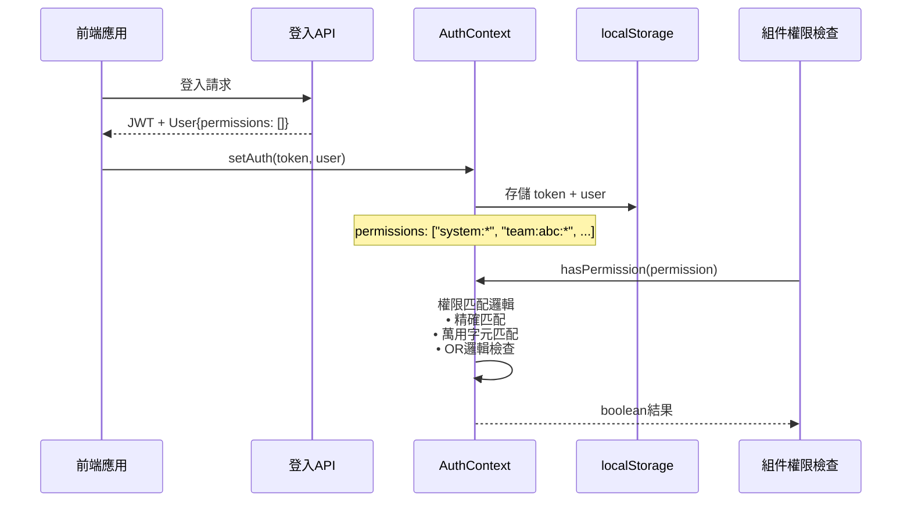
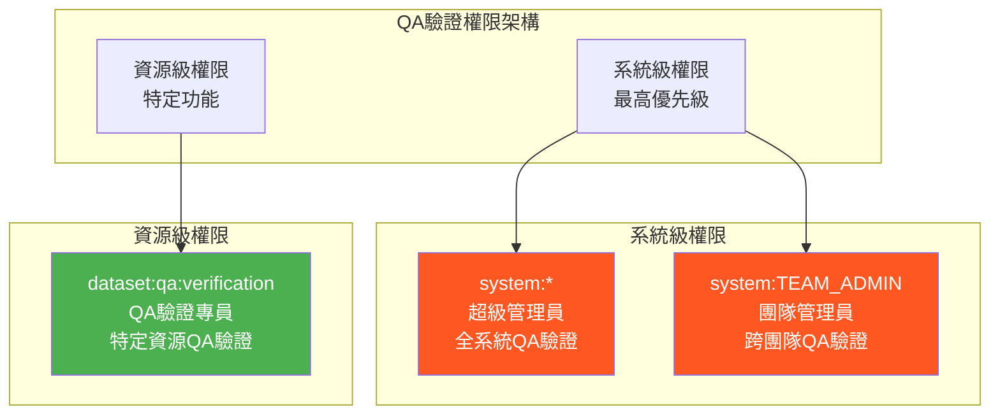

# 🔐 前端權限控制標準文檔

## 📋 目錄
- [概述](#概述)
- [權限架構分析](#權限架構分析)
- [權限控制三層分工模型](#權限控制三層分工模型)
- [權限檢查規則](#權限檢查規則)
- [權限級別標準定義](#權限級別標準定義)
- [模塊權限映射標準](#模塊權限映射標準)
- [QA驗證權限架構](#qa驗證權限架構)
- [前端實作標準](#前端實作標準)
- [修復計劃](#修復計劃)
- [測試驗證](#測試驗證)

---

## 🎯 概述

本文檔基於 `doc/auth.md` 的後端權限架構設計，制定前端權限控制的標準化規範。解決前後端權限檢查不一致、權限邏輯重複等問題，建立統一的權限控制標準。

### 核心設計原則
1. **遵循後端權限架構**：完全按照既有的三層權限體系
2. **明確前後端職責**：避免重複檢查，各司其職
3. **支援多級權限檢查**：系統級 OR 資源級的靈活權限控制
4. **向後相容性**：保持現有功能正常運作

---

## 🏗️ 權限架構分析

### 現有後端權限體系（基於 doc/auth.md）

```mermaid
graph TB
    subgraph "權限層級體系"
        A[系統級權限<br/>SystemPermission] 
        B[團隊級權限<br/>TeamPermission]
        C[數據集權限<br/>DatasetPermission]
        
        A -.->|系統管理員擁有| B
        B -.->|團隊成員繼承| C
    end
    
    subgraph "系統級權限範疇"
        A1[system:*<br/>超級管理員]
        A2[system:team:*<br/>團隊管理員]
        A3[system:user:*<br/>用戶管理員]
        A4[system:dataset:*<br/>知識庫管理員]
        
        A --> A1
        A --> A2
        A --> A3
        A --> A4
    end
    
    subgraph "團隊級權限格式"
        B1[team:{'{teamId}'}:team:view<br/>查看團隊]
        B2[team:{'{teamId}'}:members:invite<br/>邀請成員]
        B3[team:{'{teamId}'}:roles:manage<br/>管理角色]
        
        B --> B1
        B --> B2
        B --> B3
    end
    
    subgraph "資源級權限範疇"
        C1[dataset:view<br/>查看知識庫]
        C2[dataset:qa:verification<br/>QA驗證]
        C3[dataset:file:upload<br/>上傳檔案]
        
        C --> C1
        C --> C2
        C --> C3
    end
```

### 權限資料流向



---

## 📋 權限控制三層分工模型

基於問題分析，建立明確的前後端職責分工：

| 層級 | 負責方 | 職責 | 檢查內容 | 實例 |
|------|--------|------|----------|------|
| **資料存取層** | 後端 | 完全控制 | 用戶能看到哪些資料 | TeamController 過濾團隊列表 |
| **功能操作層** | 前後端 | 共同控制 | 用戶能執行哪些操作 | 邀請成員、刪除團隊按鈕 |
| **UI顯示層** | 前端 | 體驗優化 | 哪些按鈕/選單顯示 | 基於操作權限的按鈕顯示 |

### 職責詳細說明

#### 後端職責
- ✅ **資料存取控制**：在 API 層面過濾用戶可見的資料
- ✅ **最終權限驗證**：所有操作的最終安全檢查
- ✅ **權限資料提供**：登入時返回用戶完整權限列表

#### 前端職責
- ❌ **不檢查資料存取**：完全信任後端返回的資料
- ✅ **功能操作預檢**：提升用戶體驗，避免無效請求
- ✅ **UI顯示控制**：根據權限顯示/隱藏功能按鈕

---

## 🔍 權限檢查規則

### 規則1: 資料顯示 - 信任後端
對於後端返回的資料列表，前端應直接顯示，不再做權限檢查。

```typescript
// ❌ 錯誤 - 重複檢查資料存取權限
<PermissionGate permission="system:team:manage">
  <TeamList teams={managedTeams} />  // 後端已經過濾了
</PermissionGate>

// ✅ 正確 - 直接顯示後端資料
<TeamList teams={managedTeams} />
```

**適用場景**：
- 團隊列表（後端已按用戶權限過濾）
- 知識庫列表（後端已按存取權限過濾）
- 用戶列表（後端已按管理權限過濾）

### 規則2: 功能操作 - 檢查操作權限
對於具體的操作按鈕和功能，前端應檢查對應的操作權限。

```typescript
// ✅ 正確 - OR邏輯：系統級權限 OR 資源級權限
<PermissionGate permission={[
  "system:team:manage",           // 系統級管理員可以 OR
  `team:${teamId}:members:invite` // 團隊級邀請權限
]}>
  <Button onClick={handleInvite}>邀請成員</Button>
</PermissionGate>
```

**適用場景**：
- 邀請成員按鈕
- 刪除團隊按鈕
- 編輯知識庫按鈕
- QA驗證功能

### 規則3: 導航控制 - 檢查頁面權限
對於導航選單和路由存取，前端應檢查相應的查看權限。

```typescript
// navBarUtils.ts
{
  key: "users",
  label: "使用者管理", 
  path: "/users",
  permission: "system:user:view"  // 需要系統級查看權限
}
```

**適用場景**：
- 用戶管理頁面入口
- QA驗證管理頁面
- 系統設定頁面

---

## 🎯 權限級別標準定義

### 系統級權限 (system:*)
用於跨資源的管理權限，具有最高優先級。

```typescript
SYSTEM: {
  SUPER_ADMIN: "system:*",              // 系統超級管理員
  TEAM_ADMIN: "system:TEAM_ADMIN",      // 團隊管理員
  USER_ADMIN: "system:user:*",          // 用戶管理員
  DATASET_ADMIN: "system:dataset:*",    // 知識庫管理員
  TEAM_MANAGE: "system:team:manage",    // 管理團隊功能
  USER_INVITE: "system:user:invite"     // 邀請用戶功能
}
```

### 團隊級權限 (team:{id}:*)
特定團隊內的操作權限，格式：`team:{teamId}:{action}`

```typescript
TEAM: {
  VIEW: "team:view",              // 查看團隊資訊
  EDIT: "team:edit",              // 編輯團隊設定
  MEMBERS_INVITE: "members:invite", // 邀請團隊成員
  ROLES_MANAGE: "roles:manage"    // 管理團隊角色
}
```

### 資源級權限 (dataset:*/qa:*)
特定資源的操作權限，提供細粒度控制。

```typescript
DATASET: {
  VIEW: "dataset:view",                 // 查看知識庫
  MANAGE: "dataset:manage",             // 管理知識庫
  FILE_UPLOAD: "dataset:file:upload",   // 上傳檔案
  FILE_DELETE: "dataset:file:delete",   // 刪除檔案
  QA_VERIFICATION: "dataset:qa:verification" // QA驗證權限
}
```

### 權限匹配邏輯
基於 `AuthContext.tsx` 的實作邏輯：

1. **精確匹配**：`system:user:view` === `system:user:view` ✅
2. **萬用字元匹配**：`team:abc:*` 匹配 `team:abc:members:invite` ✅
3. **前綴匹配**：`system:*` 匹配 `system:team:manage` ✅
4. **OR邏輯**：陣列中任一權限符合即通過 ✅

---

## 📊 模塊權限映射標準

### 團隊管理模塊

| 功能 | 前端檢查權限 | 邏輯 | 說明 |
|------|-------------|------|------|
| 查看團隊列表 | 無需檢查 | - | 後端已過濾用戶可見團隊 |
| 創建團隊 | `system:team:manage` | - | 需要系統級團隊管理權限 |
| 邀請成員 | `["system:team:manage", "team:{id}:members:invite"]` | OR | 系統級 OR 團隊級權限 |
| 編輯團隊 | `["system:team:manage", "team:{id}:team:edit"]` | OR | 系統級 OR 團隊級權限 |
| 管理角色 | `["system:team:manage", "team:{id}:roles:manage"]` | OR | 系統級 OR 團隊級權限 |
| 查看團隊詳情 | `["system:team:*", "team:{id}:team:view"]` | OR | 系統級 OR 團隊級權限 |

### 知識庫管理模塊

| 功能 | 前端檢查權限 | 邏輯 | 說明 |
|------|-------------|------|------|
| 查看知識庫列表 | 無需檢查 | - | 後端已按存取權限過濾 |
| 上傳檔案 | `dataset:file:upload` | - | 資源級權限 |
| 刪除檔案 | `dataset:file:delete` | - | 資源級權限 |
| 管理知識庫 | `["system:dataset:*", "dataset:manage"]` | OR | 系統級 OR 資源級權限 |
| QA驗證功能 | `["system:*", "system:TEAM_ADMIN", "dataset:qa:verification"]` | OR | 三級權限檢查 |

### 用戶管理模塊

| 功能 | 前端檢查權限 | 邏輯 | 說明 |
|------|-------------|------|------|
| 存取頁面 | `system:user:view` | - | 系統級用戶查看權限 |
| 邀請用戶 | `system:user:invite` | - | 系統級功能 |
| 用戶啟用停用 | `system:user:*` | - | 系統級用戶管理權限 |
| 查看用戶列表 | 無需檢查 | - | 後端已按權限過濾 |

---

## 🔍 QA驗證權限架構

基於 `PERMISSIONS_ARCHITECTURE.md` 的QA驗證權限設計：

### QA驗證權限分級



### QA驗證功能權限映射

| 功能 | 前端檢查權限 | 邏輯 | 權限等級 |
|------|-------------|------|----------|
| QA驗證頁面入口 | `["system:*", "system:TEAM_ADMIN", "dataset:qa:verification"]` | OR | 三級檢查 |
| 查看QA列表 | `["system:*", "system:TEAM_ADMIN", "dataset:qa:verification"]` | OR | 三級檢查 |
| 批量更新QA狀態 | `["system:*", "system:TEAM_ADMIN", "dataset:qa:verification"]` | OR | 三級檢查 |
| QA向量化管理 | `["system:*", "system:TEAM_ADMIN", "dataset:qa:verification"]` | OR | 三級檢查 |
| QA統計資訊 | `["system:*", "system:TEAM_ADMIN", "dataset:qa:verification"]` | OR | 三級檢查 |

### QA驗證權限者分析

| 權限等級 | 角色/權限 | 權限範圍 | 測試帳號 | 說明 |
|---------|----------|---------|----------|------|
| **最高級** | `system:*` | 全系統QA驗證 | `super_admin` | 系統超級管理員，可審核所有QA |
| **高級** | `system:TEAM_ADMIN` | 跨團隊QA驗證 | `team_admin` | 團隊管理員，可管理多個團隊的QA |
| **專門級** | `dataset:qa:verification` | 特定資源QA驗證 | 需要建立 | QA審核專員，針對授權知識庫的QA驗證 |

---

## 🛠️ 前端實作標準

### 權限常數檔案標準

```typescript
// src/constants/permissionStandards.ts
export const PERMISSION_CONSTANTS = {
  SYSTEM: {
    SUPER_ADMIN: "system:*",
    TEAM_ADMIN: "system:TEAM_ADMIN", 
    USER_ADMIN: "system:user:*",
    DATASET_ADMIN: "system:dataset:*",
    TEAM_MANAGE: "system:team:manage",
    USER_INVITE: "system:user:invite",
    USER_VIEW: "system:user:view"
  },
  TEAM: {
    VIEW: "team:view",
    EDIT: "team:edit", 
    MEMBERS_INVITE: "members:invite",
    ROLES_MANAGE: "roles:manage"
  },
  DATASET: {
    VIEW: "dataset:view",
    MANAGE: "dataset:manage",
    FILE_UPLOAD: "dataset:file:upload",
    FILE_DELETE: "dataset:file:delete",
    QA_VERIFICATION: "dataset:qa:verification"
  }
};

// 權限格式生成器
export const PermissionBuilder = {
  team: (teamId: string, action: string) => `team:${teamId}:${action}`,
  dataset: (datasetId: string, action: string) => `dataset:${datasetId}:${action}`,
  
  // 多級權限檢查陣列生成
  teamPermission: (teamId: string, action: string) => [
    PERMISSION_CONSTANTS.SYSTEM.TEAM_MANAGE,
    `team:${teamId}:${action}`
  ],
  
  qaVerification: () => [
    PERMISSION_CONSTANTS.SYSTEM.SUPER_ADMIN,
    PERMISSION_CONSTANTS.SYSTEM.TEAM_ADMIN,
    PERMISSION_CONSTANTS.DATASET.QA_VERIFICATION
  ]
};
```

### Hook 標準模式

#### 團隊權限Hook

```typescript
// src/pages/team/hooks/useTeamPermissions.ts
import { useAuth } from '../../../context/AuthContext';
import { PERMISSION_CONSTANTS, PermissionBuilder } from '../../../constants/permissionStandards';

export const useTeamPermissions = (teamId: string) => {
  const { hasPermission } = useAuth();
  
  if (!teamId) {
    return {
      canInviteMembers: false,
      canEditTeam: false,
      canManageRoles: false,
      canViewTeamDetail: false
    };
  }
  
  return {
    // 邀請成員：系統級 OR 團隊級權限
    canInviteMembers: hasPermission(
      PermissionBuilder.teamPermission(teamId, PERMISSION_CONSTANTS.TEAM.MEMBERS_INVITE)
    ),
    
    // 編輯團隊：系統級 OR 團隊級權限
    canEditTeam: hasPermission(
      PermissionBuilder.teamPermission(teamId, PERMISSION_CONSTANTS.TEAM.EDIT)
    ),
    
    // 管理角色：系統級 OR 團隊級權限
    canManageRoles: hasPermission(
      PermissionBuilder.teamPermission(teamId, PERMISSION_CONSTANTS.TEAM.ROLES_MANAGE)
    ),
    
    // 查看團隊詳情：系統級 OR 團隊級權限
    canViewTeamDetail: hasPermission([
      PERMISSION_CONSTANTS.SYSTEM.TEAM_ADMIN,
      PermissionBuilder.team(teamId, PERMISSION_CONSTANTS.TEAM.VIEW)
    ])
  };
};
```

#### QA驗證權限Hook

```typescript
// src/hooks/useQAPermissions.ts
import { useAuth } from '../context/AuthContext';
import { PermissionBuilder } from '../constants/permissionStandards';

export const useQAPermissions = () => {
  const { hasPermission } = useAuth();
  
  // QA驗證權限：三級權限檢查（OR邏輯）
  const canVerifyQA = hasPermission(PermissionBuilder.qaVerification());
  
  return {
    canVerifyQA,
    canViewQAList: canVerifyQA,
    canUpdateQAStatus: canVerifyQA,
    canManageQAVectors: canVerifyQA,
    canViewQAStats: canVerifyQA
  };
};
```

### PermissionGate 使用標準

#### 基本使用模式

```typescript
// 單一權限檢查
<PermissionGate permission="system:user:view">
  <Button>系統功能</Button>
</PermissionGate>

// 多權限檢查（OR邏輯）
<PermissionGate permission={[
  "system:team:manage",
  `team:${teamId}:members:invite`
]}>
  <Button onClick={handleInvite}>邀請成員</Button>
</PermissionGate>

// 使用權限常數
<PermissionGate permission={PermissionBuilder.qaVerification()}>
  <Button onClick={handleQAVerification}>QA驗證</Button>
</PermissionGate>
```

### 導航選單標準

```typescript
// src/utils/navBarUtils.ts
export const NAV_MENU_CONFIG: NavMenuConfig[] = [
  {
    key: "knowledge",
    label: "知識庫", 
    path: "/knowledge",
    icon: "GlobalOutlined"
    // 無權限要求 - 所有登入用戶可存取
  },
  {
    key: "teams",
    label: "團隊",
    path: "/teams", 
    icon: "TeamOutlined"
    // 無權限要求 - 所有登入用戶可存取
  },
  {
    key: "qa-verification",
    label: "QA驗證",
    path: "/qa-verification",
    icon: "CheckCircleOutlined",
    permissions: PermissionBuilder.qaVerification() // 三級權限檢查
  },
  {
    key: "users",
    label: "使用者管理",
    path: "/users",
    icon: "UserOutlined",
    permission: PERMISSION_CONSTANTS.SYSTEM.USER_VIEW // 系統級權限
  }
];

// 導航過濾邏輯更新
export function getFilteredNavItems(hasPermission: (permission: string | string[]) => boolean) {
  return NAV_MENU_CONFIG.filter(item => {
    if (item.permission) {
      return hasPermission(item.permission);
    }
    if (item.permissions) {
      return hasPermission(item.permissions);
    }
    return true; // 無權限要求的項目直接顯示
  });
}
```

---

## 📋 修復計劃

### Phase 1: 緊急修復（已完成）
- ✅ **團隊頁面權限閘門修復**：移除 TeamSider 中不當的 `system:team:manage` 權限檢查
- ✅ **建立權限控制標準文檔**：本文檔

### Phase 2: 高優先級修復
- ❌ **知識庫載入API修復**：解決 Spring Data Couchbase 參數綁定問題
  - 檔案：`DatasetRepository.java:30`
  - 問題：`findVisibleDatasets` 方法參數不匹配
  - 影響：sam0219mm 等非系統管理員用戶無法載入知識庫

### Phase 3: 標準化實作
- 🔄 **建立權限常數檔案**：實作 `permissionStandards.ts`
- 🔄 **重構權限Hook**：按照新標準重構 `useTeamPermissions`
- 🔄 **新增QA驗證權限檢查**：實作 `useQAPermissions` Hook

### Phase 4: 系統驗證
- 🔄 **多角色功能測試**：使用不同測試帳號驗證各模塊功能
- 🔄 **權限一致性檢查**：確保前後端權限定義一致
- 🔄 **建立權限測試清單**：自動化權限測試

---

## 🧪 測試驗證

### 測試帳號權限驗證

基於現有測試帳號的權限預期行為：

| 用戶 | 角色 | 團隊頁面 | 知識庫 | QA驗證 | 用戶管理 |
|------|------|---------|--------|-------|----------|
| `super_admin` | SUPER_ADMIN | ✅ 完整權限 | ✅ 完整權限 | ✅ 完整權限 | ✅ 完整權限 |
| `team_admin` | TEAM_ADMIN | ✅ 管理權限 | ✅ 查看權限 | ✅ 驗證權限 | ❌ 無權限 |
| `user_admin` | USER_ADMIN | ❌ 查看權限 | ✅ 查看權限 | ❌ 無權限 | ✅ 管理權限 |
| `sam0219mm` | USER | ✅ 成員權限 | ✅ 查看權限 | ❌ 無權限 | ❌ 無權限 |

### 功能測試清單

#### 團隊模塊測試
- [ ] sam0219mm 登入後能看到「我的團隊」和「管理團隊」區塊
- [ ] sam0219mm 能查看 TEST 團隊詳情（團隊擁有者）
- [ ] sam0219mm 能邀請 TEST 團隊成員（團隊擁有者權限）
- [ ] team_admin 能管理所有團隊（系統級權限）
- [ ] super_admin 具有完整團隊管理權限

#### 知識庫模塊測試
- [ ] sam0219mm 能看到有權限的知識庫列表
- [ ] 修復知識庫載入API後，sam0219mm 能正常使用聊天功能
- [ ] super_admin 和 team_admin 能看到QA驗證入口
- [ ] sam0219mm 看不到QA驗證功能

#### 用戶管理模塊測試
- [ ] 只有 super_admin 和 user_admin 能存取用戶管理頁面
- [ ] sam0219mm 和 team_admin 看不到「使用者管理」選單

#### 導航選單測試
- [ ] 所有用戶都能看到「知識庫」、「團隊」、「聊天」選單
- [ ] 只有具備相應權限的用戶能看到「QA驗證」、「使用者管理」選單
- [ ] 選單項目與用戶實際權限一致

### 權限一致性檢查

#### 前後端權限格式對照
- [ ] 前端權限常數與後端 `SystemPermission.java` 一致
- [ ] 前端權限常數與後端 `TeamPermission.java` 一致  
- [ ] 前端權限常數與後端 `DatasetPermission.java` 一致
- [ ] QA驗證權限格式與後端定義一致

#### 權限檢查邏輯驗證
- [ ] OR邏輯正確實作（陣列中任一權限符合即通過）
- [ ] 萬用字元匹配正確運作（`team:*` 匹配 `team:abc:view`）
- [ ] 系統級權限優先級正確（`system:*` 匹配所有系統級操作）

---

## 📝 總結

本標準文檔解決了前端權限控制的核心問題：

### 解決的問題
1. ✅ **前後端權限不一致**：統一使用後端定義的權限格式
2. ✅ **權限邏輯重複**：明確前後端職責分工，避免重複檢查
3. ✅ **缺乏標準化**：建立統一的權限檢查模式和工具
4. ✅ **QA驗證權限整合**：完整整合新的QA驗證權限體系

### 建立的標準
1. 🎯 **三層分工模型**：資料存取、功能操作、UI顯示的明確分工
2. 🎯 **三種檢查規則**：資料顯示、功能操作、導航控制的標準模式
3. 🎯 **統一權限格式**：基於後端定義的標準權限常數
4. 🎯 **多級權限檢查**：支援 OR 邏輯的系統級+資源級權限檢查

### 後續工作
按照修復計劃分階段實作，優先解決知識庫載入API的技術問題，然後逐步標準化各模塊的權限控制，最終建立完整的權限測試體系。

---

*本文檔基於 `doc/auth.md` 和 `PERMISSIONS_ARCHITECTURE.md` 制定，與後端權限架構完全一致。*