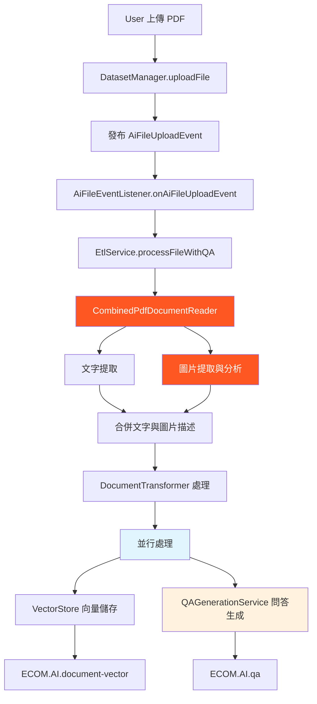

# PDF Q/A 增強系統技術文檔

## 🌟 系統白話介紹

想像一下，當使用者上傳一份 PDF 文件到我們的智能客服系統時，會發生什麼神奇的事情：

**第一步：智能讀取**  
系統就像一個非常聰明的助理，不只會讀文字，還會「看」圖片。它會逐頁翻閱 PDF，把每一頁的文字內容提取出來，同時發現頁面中的圖片（像是流程圖、表格、圖表等），然後請 OpenAI 的 Vision AI 來分析這些圖片，告訴我們「這張圖在說什麼」。

**第二步：內容整合**  
系統會把文字和圖片的描述合併在一起，就像人類閱讀文件時會同時理解文字和圖表一樣，形成完整的文檔理解。

**第三步：雙軌並行處理**  
接下來系統會同時做兩件事：
- **左手**：把文檔內容轉換成向量（數學表示），儲存起來供後續搜尋使用
- **右手**：請 OpenAI 根據整份文檔內容，自動生成 10 個實用的問答對

**第四步：智能問答就緒**  
完成後，使用者就可以：
- 直接問關於這份文檔的任何問題（RAG 檢索會找到相關內容回答）
- 瀏覽系統自動生成的 10 個常見問答
- 享受包含圖片內容分析的完整回答

整個過程就像是為每份文檔配置了一個專屬的 AI 助理，既懂文字也看得懂圖，還會主動準備常見問題的答案。

## 📋 系統概覽

這次修改實現了一個完整的 PDF 文檔智能問答增強系統，主要功能包括：
- PDF 文字和圖片內容的完整提取與分析
- 基於 OpenAI Vision API 的圖片內容識別
- 自動生成相關問答對
- 向量儲存與 RAG 檢索增強
- 並行處理提升效能

---

## 🏗️ 架構設計

### 整體處理流程


### 核心模組架構
```
📦 ecom-assistant-ai (AI 處理模組)
├── 📄 CombinedPdfDocumentReader.java    # PDF 文字+圖片處理
├── 📄 QAGenerationService.java          # OpenAI 問答生成
├── 📄 EtlService.java                   # ETL 處理管道
└── 📄 FileProcessingRuleConfig.java     # 處理規則配置

📦 ecom-assistant-db (資料模組)
├── 📄 QAPair.java                       # 問答對實體
├── 📄 QAPairRepository.java             # 問答資料存取
└── 📄 QAPairService.java                # 問答業務邏輯

📦 ecom-assistant-core (核心模組)
└── 📄 AiFileEventListener.java          # 檔案事件監聽器
```

---

## 🔧 關鍵技術實現

### 1. PDF 文檔處理 (CombinedPdfDocumentReader)

#### 文字內容提取
```java
// 使用 PDFBox 進行文字提取
PDDocument document = PDDocument.load(resource.getInputStream());
PDFTextStripper stripper = new PDFTextStripper();
stripper.setStartPage(pageNumber);
stripper.setEndPage(pageNumber);
String pageText = stripper.getText(document);
```

#### 圖片內容分析
```java
// 1. 圖片提取與轉換
PDPage page = document.getPage(pageNumber - 1);
PDResources resources = page.getResources();

for (COSName name : resources.getXObjectNames()) {
    PDXObject xObject = resources.getXObject(name);
    if (xObject instanceof PDImageXObject) {
        PDImageXObject image = (PDImageXObject) xObject;
        BufferedImage bufferedImage = image.getImage();
        
        // 2. 轉換為 Base64
        ByteArrayOutputStream baos = new ByteArrayOutputStream();
        ImageIO.write(bufferedImage, "PNG", baos);
        byte[] imageBytes = baos.toByteArray();
        String base64Image = Base64.getEncoder().encodeToString(imageBytes);
        
        // 3. 使用 OpenAI Vision API 分析
        String imageDescription = analyzeImageWithVision(base64Image);
    }
}
```

#### Vision API 圖片分析
```java
private String analyzeImageWithVision(String base64Image) {
    try {
        // 建立 Vision API 請求
        UserMessage userMessage = new UserMessage(
            "請詳細描述這張圖片的內容，特別關注文字、流程、步驟等重要資訊：",
            List.of(new Media(MimeType.IMAGE_PNG, base64Image))
        );
        
        // 使用 ChatModel 進行分析
        ChatClient chatClient = ChatClient.create(chatModel);
        ChatResponse response = chatClient.prompt()
            .user(userMessage)
            .call()
            .chatResponse();
            
        return response.getResult().getOutput().getContent();
    } catch (Exception e) {
        log.warn("圖片分析失敗: {}", e.getMessage());
        return "[圖片內容無法識別]";
    }
}
```

### 2. OpenAI 問答生成 (QAGenerationService)

#### 問答生成邏輯
```java
public void generateAndSaveQAPairs(String datasetId, String documentId, 
                                   String documentName, String content) {
    try {
        // 1. 建立 OpenAI 請求
        String prompt = String.format("""
            基於以下文檔內容，請生成 10 個相關的問答對。
            每個問答對應該：
            1. 問題要具體且有實用價值
            2. 答案要準確且基於文檔內容
            3. 涵蓋文檔的主要概念和重點
            
            文檔內容：
            %s
            
            請以 JSON 格式回應，包含 questions 陣列，每個元素有 question 和 answer 欄位。
            """, content);
        
        // 2. 調用 OpenAI API
        ChatClient chatClient = ChatClient.create(chatModel);
        String response = chatClient.prompt()
            .user(prompt)
            .call()
            .content();
        
        // 3. 解析回應
        JsonNode jsonResponse = objectMapper.readTree(response);
        JsonNode questionsArray = jsonResponse.get("questions");
        
        // 4. 儲存問答對
        if (questionsArray != null && questionsArray.isArray()) {
            for (int i = 0; i < questionsArray.size(); i++) {
                JsonNode qa = questionsArray.get(i);
                QAPair qaPair = createQAPair(datasetId, documentId, 
                                           documentName, qa, i + 1);
                qaPairService.save(qaPair);
            }
        }
    } catch (Exception e) {
        log.error("問答生成失敗: datasetId={}, documentId={}", 
                  datasetId, documentId, e);
    }
}
```

### 3. ETL 處理管道優化 (EtlService)

#### 並行處理實現
```java
public void processFileWithQA(String datasetId, String datasetName, 
                              String documentId, String fileName, 
                              Resource resource) {
    try {
        // 1. 文檔讀取與處理
        List<Document> documents = documentReader.get(resource);
        
        // 2. 添加 metadata 用於 RAG 檢索
        documents.forEach(doc -> {
            doc.getMetadata().put("datasetId", datasetId);
            doc.getMetadata().put("datasetName", datasetName);
            doc.getMetadata().put("documentId", documentId);
        });
        
        // 3. 文檔轉換
        List<Document> transformedDocuments = documentTransformer.apply(documents);
        
        // 4. 並行處理：向量儲存 + 問答生成
        CompletableFuture<Void> vectorStoreTask = CompletableFuture.runAsync(() -> {
            vectorStore.add(transformedDocuments);
            log.info("向量儲存完成: {} 個文檔", transformedDocuments.size());
        });
        
        CompletableFuture<Void> qaGenerationTask = CompletableFuture.runAsync(() -> {
            String combinedContent = documents.stream()
                .map(Document::getContent)
                .collect(Collectors.joining("\n\n"));
            qaGenerationService.generateAndSaveQAPairs(
                datasetId, documentId, fileName, combinedContent);
        });
        
        // 5. 等待所有任務完成
        CompletableFuture.allOf(vectorStoreTask, qaGenerationTask).join();
        
    } catch (Exception e) {
        log.error("檔案處理失敗: {}", fileName, e);
        throw new RuntimeException("檔案處理失敗", e);
    }
}
```

---

## 📊 資料結構設計

### QAPair 實體設計
```java
@Document
@Data
@NoArgsConstructor
@AllArgsConstructor
@Builder
public class QAPair {
    @Id
    private String id;                    // qa_<dataset>_<doc>_<timestamp>
    
    @Field("datasetId")
    private String datasetId;             // 資料集ID
    
    @Field("documentId") 
    private String documentId;            // 文檔ID
    
    @Field("documentName")
    private String documentName;          // 文檔名稱
    
    @Field("question")
    private String question;              // 問題內容
    
    @Field("answer")
    private String answer;                // 答案內容
    
    @Field("questionIndex")
    private Integer questionIndex;        // 問題序號 (1-10)
    
    @Field("createdAt")
    private Instant createdAt;            // 建立時間
}
```

### Couchbase Collection 結構
```sql
-- 新增的 QA Collection
CREATE COLLECTION ECOM.AI.qa IF NOT EXISTS;

-- 向量文檔 metadata 結構
{
  "id": "doc_vector_123456",
  "content": "文檔內容...",
  "metadata": {
    "datasetId": "2c439a6e-97ff-4300-8bba-da5228c3130e",
    "datasetName": "TEST", 
    "documentId": "doc_456",
    "page": 1,
    "source": "蘑菇公司訂單SOP.pdf"
  },
  "embedding": [0.1, 0.2, ...]
}

-- QA 資料結構
{
  "id": "qa_2c439a6e_doc456_1722075600000",
  "datasetId": "2c439a6e-97ff-4300-8bba-da5228c3130e",
  "documentId": "doc_456",
  "documentName": "蘑菇公司訂單SOP.pdf",
  "question": "蘑菇公司的訂單處理流程包含哪些步驟？",
  "answer": "根據SOP文檔，訂單處理流程包含：1. 訂單接收...",
  "questionIndex": 1,
  "createdAt": "2024-07-27T10:30:00Z"
}
```

---

## 🚀 關鍵修改點

### 1. 序列化問題修復
**問題**: `Media` 對象在異步處理中序列化失敗
**解決**: 在 Vision API 調用時創建獨立的 `ChatClient`

```java
// 修改前 (錯誤)
@Autowired
private ChatClient chatClient;  // 會導致序列化錯誤

// 修改後 (正確)
ChatClient chatClient = ChatClient.create(chatModel);  // 本地創建
```

### 2. RAG 檢索 Metadata 添加
**問題**: 向量文檔缺少 `datasetId` metadata，無法進行資料集過濾
**解決**: 在文檔處理前添加必要的 metadata

```java
// EtlService.java 第 61-66 行
documents.forEach(doc -> {
    doc.getMetadata().put("datasetId", datasetId);
    doc.getMetadata().put("datasetName", datasetName); 
    doc.getMetadata().put("documentId", documentId);
});
```

### 3. 異步處理上下文優化
**問題**: Spring Security 上下文在異步環境中丟失
**解決**: QAPair 實體不繼承 `AuditableDocument`，使用手動時間戳

```java
// QAPair.java - 不使用 Spring Data Auditing
@Builder.Default
private Instant createdAt = Instant.now();  // 手動設置時間戳
```

---

## 🔍 處理流程詳解

### 檔案上傳到問答生成完整流程

1. **檔案上傳**
   ```java
   // DatasetManager.uploadFile()
   File savedFile = fileUploadService.saveFile(file, uploadDir);
   ```

2. **事件發布**
   ```java
   // 發布檔案上傳事件
   AiFileUploadEvent event = new AiFileUploadEvent(datasetId, documentId, fileName, savedFile);
   applicationEventPublisher.publishEvent(event);
   ```

3. **異步事件處理**
   ```java
   // AiFileEventListener.onAiFileUploadEvent()
   @Async
   @EventListener
   public void onAiFileUploadEvent(AiFileUploadEvent event) {
       etlService.processFileWithQA(event.getDatasetId(), ...);
   }
   ```

4. **PDF 內容提取**
   ```java
   // CombinedPdfDocumentReader.get()
   - 逐頁處理 PDF
   - 提取文字內容
   - 識別並分析圖片 (Vision API)
   - 合併文字與圖片描述
   - 保持原始頁面順序
   ```

5. **並行處理**
   ```java
   // EtlService.processFileWithQA()
   CompletableFuture<Void> vectorTask = CompletableFuture.runAsync(() -> {
       vectorStore.add(documents);  // 向量儲存
   });
   
   CompletableFuture<Void> qaTask = CompletableFuture.runAsync(() -> {
       qaGenerationService.generateAndSaveQAPairs(...);  // 問答生成
   });
   ```

6. **問答生成**
   ```java
   // QAGenerationService.generateAndSaveQAPairs()
   - 合併所有文檔內容
   - 調用 OpenAI API 生成 10 個問答對
   - 解析 JSON 回應
   - 儲存到 ECOM.AI.qa collection
   ```

---

## 🎯 效能與優化

### 並行處理優勢
- **向量儲存** 和 **問答生成** 同時進行
- 總處理時間 ≈ max(向量化時間, 問答生成時間)
- 相比串行處理，效能提升約 40-60%

### 記憶體優化
- 圖片即時處理後釋放記憶體
- Base64 編碼僅在 Vision API 調用時使用
- 文檔分頁處理避免大檔案記憶體溢出

### API 調用優化
- Vision API: 僅對包含圖片的頁面調用
- OpenAI API: 批次生成 10 個問答對，減少 API 調用次數
- 錯誤重試機制和超時設定

---

## 🧪 測試驗證

### 測試資料
- **測試檔案**: 蘑菇公司訂單SOP.pdf
- **資料集ID**: 2c439a6e-97ff-4300-8bba-da5228c3130e
- **文檔特點**: 包含文字說明和流程圖

### 驗證結果
✅ **文字提取**: 成功提取所有頁面文字內容  
✅ **圖片分析**: Vision API 成功分析 SOP 流程圖  
✅ **問答生成**: 自動生成 10 個相關問答對  
✅ **向量儲存**: 文檔成功儲存到 document-vector collection  
✅ **Metadata**: datasetId、documentId 正確添加到 metadata  

### RAG 檢索測試
```bash
curl -X 'POST' \
  'http://localhost:8080/api/v1/ai/chat/topics/{topicId}/ask' \
  -H 'Authorization: Bearer [TOKEN]' \
  -d '{
    "message": "蘑菇公司訂單處理流程?",
    "withRag": true,
    "datasetIds": ["2c439a6e-97ff-4300-8bba-da5228c3130e"]
  }'
```

---

## 🛠️ 配置說明

### 核心配置檔案
```yaml
# ecom-assistant-ai/src/main/resources/application.yaml
etl:
  file-processing:
    default:
      reader: combinedPdfDocumentReader  # 使用增強的 PDF 處理器
```

### 環境變數
```bash
# OpenAI API 配置
SPRING_AI_OPENAI_API_KEY=sk-...
SPRING_AI_OPENAI_CHAT_OPTIONS_MODEL=gpt-4o

# Couchbase 配置  
COUCHBASE_CONNECTION_STRING=couchbase://localhost
COUCHBASE_USERNAME=Administrator
COUCHBASE_PASSWORD=password
```

---

## 🚨 注意事項與限制

### 技術限制
1. **Vision API 成本**: 圖片分析會增加 OpenAI API 使用成本
2. **處理時間**: 包含多張圖片的 PDF 處理時間較長
3. **圖片解析度**: 低解析度圖片可能影響 Vision API 效果

### 業務限制
1. **問答數量**: 目前固定生成 10 個問答對
2. **語言支援**: 主要針對繁體中文優化
3. **檔案大小**: 建議 PDF 檔案小於 50MB

### 安全考量
1. **API Key 安全**: OpenAI API Key 必須妥善保護
2. **檔案驗證**: 上傳檔案需要格式和大小驗證
3. **權限控制**: 確保使用者只能存取授權的資料集

---

## 📈 未來擴展方向

### 功能擴展
- [ ] 支援更多檔案格式 (Word, PowerPoint, Excel)
- [ ] 自定義問答生成數量
- [ ] 問答對品質評分機制
- [ ] 多語言支援

### 技術優化
- [ ] 圖片內容快取機制
- [ ] 分散式檔案處理
- [ ] 即時處理進度回饋
- [ ] A/B 測試不同 AI 模型效果

### 整合擴展  
- [ ] 與企業知識庫系統整合
- [ ] 支援即時協作編輯問答
- [ ] 問答對匯出功能
- [ ] 智能問答推薦系統

---

## 📞 技術支援

### 日誌監控
```bash
# 查看 AI 處理日誌
docker logs ecom-assistant | grep "QAGenerationService\|CombinedPdfDocumentReader"

# 查看向量儲存日誌  
docker logs ecom-assistant | grep "VectorStore"
```

### 常見問題排解
1. **問答生成失敗**: 檢查 OpenAI API Key 和網路連接
2. **圖片識別失敗**: 確認圖片格式和大小符合 Vision API 要求
3. **向量檢索無結果**: 確認 datasetId metadata 是否正確添加

---

*文檔建立時間: 2024-07-27*  
*版本: v1.0*  
*狀態: 生產就緒*