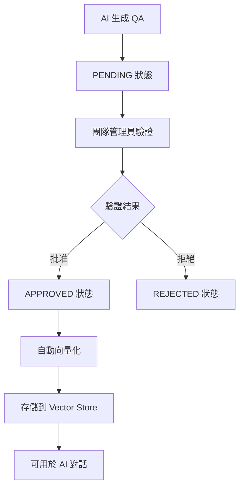
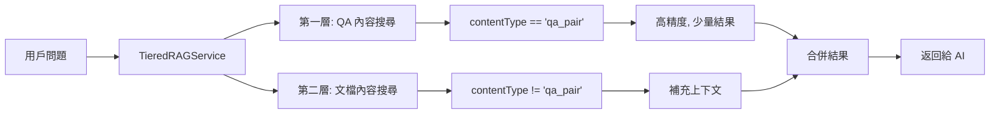

# QA 驗證與兩層優先級 RAG 檢索系統實現

## 📋 概述

本次實現了完整的 QA 驗證與向量化工作流程，以及兩層優先級的 RAG 檢索系統。系統允許團隊管理員驗證 AI 生成的問答對，並在 AI 對話中優先使用已驗證的 QA 內容。

## 🎯 核心功能

### 1. QA 驗證工作流程


### 2. 兩層優先級 RAG 檢索


## 🗄️ 資料庫架構更新

### QA Collection 增強
```sql
-- 新增 qa-vector collection (已在 schema/02_collections.sql 中)
CREATE COLLECTION `ECOM`.`AI`.`qa-vector` IF NOT EXISTS;
```

### QAPair 實體更新
```java
// 新增驗證相關欄位
private VerificationStatus verificationStatus = VerificationStatus.PENDING;
private String verifiedBy;
private LocalDateTime verifiedAt;
private Boolean vectorized = false;
private Set<String> tags; // 繼承自知識庫
private String vectorId;

public enum VerificationStatus {
    PENDING, APPROVED, REJECTED
}
```

## 💼 核心服務實現

### 1. QAVerificationService
**位置**: `ecom-assistant-db/src/main/java/com/ecom/ai/ecomassistant/db/service/QAVerificationService.java`

**主要功能**:
- QA 批准/拒絕處理
- 批量操作支援
- 狀態追蹤管理

**關鍵方法**:
```java
public QAPair approveQA(String qaId, String verifiedBy, String note)
public QAPair rejectQA(String qaId, String verifiedBy, String note)
public void batchApproveQAs(List<String> qaIds, String verifiedBy, String note)
public List<QAPair> getApprovedNotVectorizedQAs()
```

### 2. QAVectorizationService
**位置**: `ecom-assistant-ai/src/main/java/com/ecom/ai/ecomassistant/ai/service/QAVectorizationService.java`

**主要功能**:
- 已批准 QA 的向量化處理
- 異步處理支援
- 向量存儲管理

**關鍵方法**:
```java
@Async
public void vectorizeApprovedQAs()
public void vectorizeQA(QAPair qaPair)
```

### 3. TieredRAGService
**位置**: `ecom-assistant-ai/src/main/java/com/ecom/ai/ecomassistant/ai/service/TieredRAGService.java`

**主要功能**:
- 兩層優先級檢索策略  
- 智能結果合併
- 性能優化配置

**配置參數**:
```java
// QA 檢索配置
private static final int QA_TOP_K = 3;
private static final double QA_SIMILARITY_THRESHOLD = 0.75;

// Document 檢索配置  
private static final int DOC_TOP_K = 6;
private static final double DOC_SIMILARITY_THRESHOLD = 0.30;

// 總結果數量限制
private static final int MAX_TOTAL_RESULTS = 8;
```

## 🌐 API 端點

### QAVerificationController
**位置**: `ecom-assistant-api/src/main/java/com/ecom/ai/ecomassistant/controller/QAVerificationController.java`

**端點列表**:

| 方法 | 端點 | 描述 | 權限 |
|------|------|------|------|
| GET | `/api/v1/qa-verification/pending` | 獲取待驗證 QA 列表 | team.admin |
| POST | `/api/v1/qa-verification/{qaId}/approve` | 批准單個 QA | team.admin |
| POST | `/api/v1/qa-verification/{qaId}/reject` | 拒絕單個 QA | team.admin |
| POST | `/api/v1/qa-verification/batch/approve` | 批量批准 QA | team.admin |
| POST | `/api/v1/qa-verification/batch/reject` | 批量拒絕 QA | team.admin |
| GET | `/api/v1/qa-verification/pending/count` | 獲取待驗證 QA 數量 | team.admin |

**權限檢查**:
```java
private boolean hasQAVerificationPermission(String userId) {
    Set<String> requiredPermissions = Set.of(
        "team.admin", 
        "qa.verification", 
        "admin.*"
    );
    return PermissionUtil.hasAnyPermission(requiredPermissions);
}
```

## 🔄 工作流程更新

### 1. 文件處理流程
**修改檔案**: `ecom-assistant-core/src/main/java/com/ecom/ai/ecomassistant/event/listener/AiFileEventListener.java`

**更新內容**:
- 使用 `processFileWithQA()` 方法
- 自動繼承知識庫 tags
- QA 狀態設為 PENDING

### 2. QA 生成流程  
**修改檔案**: `ecom-assistant-ai/src/main/java/com/ecom/ai/ecomassistant/ai/service/QAGenerationService.java`

**更新內容**:
```java
QAPair qaPair = QAPair.builder()
    .question(info.getQuestion())
    .answer(info.getAnswer())
    .datasetId(datasetId)
    .tags(datasetTags)  // 繼承 dataset tags
    .verificationStatus(QAPair.VerificationStatus.PENDING)  // 設為待驗證
    .vectorized(false)  // 未向量化
    .contentType("qa_pair")  // 標識為 QA 內容
    .build();
```

### 3. AI 對話流程
**修改檔案**: `ecom-assistant-core/src/main/java/com/ecom/ai/ecomassistant/core/service/chat/ChatService.java`

**更新內容**:
- 整合 `TieredRAGService`
- 智能上下文構建
- 檢索結果層級標記

## 🎨 前端整合準備

### API 調用示例

#### 1. 獲取待驗證 QA 列表
```javascript
// GET /api/v1/qa-verification/pending?page=1&limit=20
const response = await fetch('/api/v1/qa-verification/pending?page=1&limit=20', {
    method: 'GET',
    headers: {
        'Authorization': `Bearer ${token}`,
        'Content-Type': 'application/json'
    }
});
```

#### 2. 批准 QA
```javascript
// POST /api/v1/qa-verification/{qaId}/approve
const response = await fetch(`/api/v1/qa-verification/${qaId}/approve`, {
    method: 'POST',
    headers: {
        'Authorization': `Bearer ${token}`,
        'Content-Type': 'application/json'
    },
    body: JSON.stringify({
        note: '內容準確，批准使用'
    })
});
```

#### 3. 批量操作
```javascript
// POST /api/v1/qa-verification/batch/approve
const response = await fetch('/api/v1/qa-verification/batch/approve', {
    method: 'POST',
    headers: {
        'Authorization': `Bearer ${token}`,
        'Content-Type': 'application/json'
    },
    body: JSON.stringify({
        qaIds: ['qa_123', 'qa_124', 'qa_125'],
        note: '批量批准操作'
    })
});
```

## 🔧 配置說明

### 向量檢索配置
在 `TieredRAGService` 中可調整的參數:

```java
// QA 檢索 - 高精度，少量結果
private static final int QA_TOP_K = 3;              // QA 結果數量
private static final double QA_SIMILARITY_THRESHOLD = 0.75;  // QA 相似度閾值

// 文檔檢索 - 補充上下文
private static final int DOC_TOP_K = 6;             // 文檔結果數量  
private static final double DOC_SIMILARITY_THRESHOLD = 0.30; // 文檔相似度閾值

// 總體限制
private static final int MAX_TOTAL_RESULTS = 8;     // 最大結果總數
```

### 異步處理配置
確保 Spring 異步配置正確啟用:

```java
@EnableAsync
@Configuration
public class AsyncConfig {
    // 異步執行器配置
}
```

## 🛠️ 故障排除

### 1. 編譯問題
如果遇到編譯錯誤，請確保：
- 所有依賴模組都已編譯
- Spring AI 版本匹配
- 權限相關類路徑正確

### 2. 權限問題
檢查用戶是否具備以下權限之一：
- `team.admin`
- `qa.verification` 
- `admin.*`

### 3. 向量化問題
如果 QA 未能正確向量化：
- 檢查 VectorStore 配置
- 確認異步處理正常運行
- 查看相關錯誤日誌

## 📊 性能監控

### 關鍵指標

1. **QA 驗證效率**
   - 待驗證 QA 數量
   - 平均驗證時間
   - 批准/拒絕比例

2. **檢索性能**
   - QA 層檢索響應時間
   - 文檔層檢索響應時間  
   - 總檢索時間

3. **向量化效率**
   - 向量化處理時間
   - 向量化成功率
   - 向量化隊列長度

### 日誌監控
重要日誌關鍵字：
- `Tiered RAG retrieval`
- `QA verification`
- `Vectorization completed`
- `Permission check failed`

## 🚀 後續開發建議

### 1. 前端 UI 開發
- QA 驗證管理介面
- 批量操作支援
- 驗證歷史記錄

### 2. 功能增強
- QA 編輯功能
- 驗證工作流程自動化
- 性能分析儀表板

### 3. 系統優化
- 檢索結果快取
- 向量化批量處理
- 權限粒度細化

## 📝 總結

本次實現成功建立了完整的 QA 驗證與兩層優先級 RAG 檢索系統，包括：

✅ **完整的後端架構** - 從資料庫到 API 的完整實現  
✅ **智能檢索策略** - 兩層優先級確保回答品質  
✅ **權限控制機制** - 基於現有 Shiro 架構的安全控制  
✅ **異步處理能力** - 高效的向量化處理流程  
✅ **可擴展設計** - 易於後續功能擴展和優化  

系統現已準備好進行測試和前端整合！

---

**實現日期**: 2025-07-28  
**版本**: v1.0  
**狀態**: ✅ 完成實現，準備測試