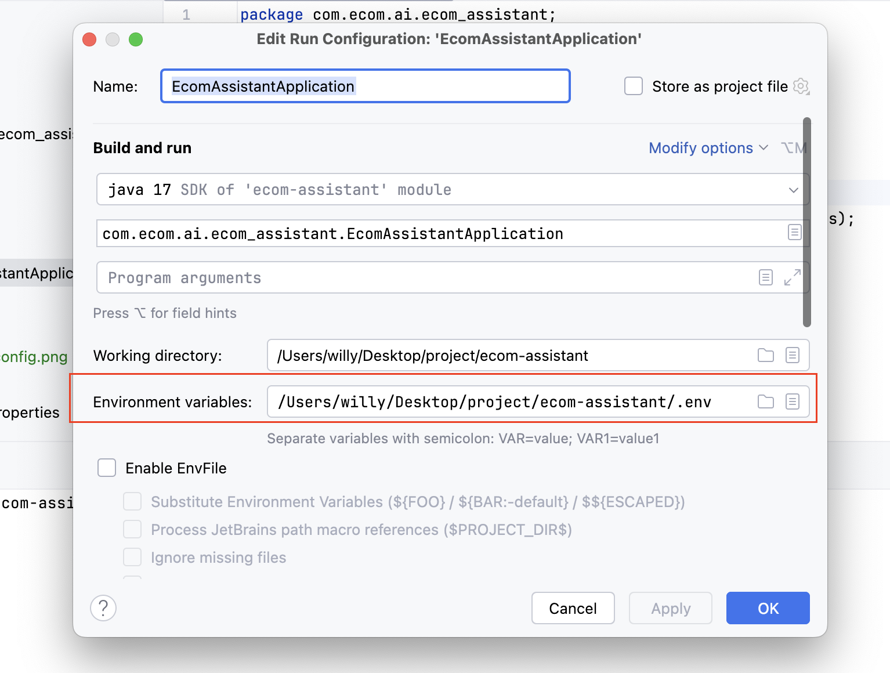

# 🤖 E-commerce AI Assistant

> 基於 Spring Boot 3.x 的智能客服助手系統，整合 RAG（檢索增強生成）技術，提供企業級的 AI 問答服務。

## ✨ 核心特性

- 🧠 **智能對話**：基於 OpenAI GPT-4 的自然語言處理
- 📚 **知識庫管理**：支援 PDF、CSV、JSON 等多種格式文件上傳與處理
- 🔍 **向量檢索**：使用 Couchbase 向量搜尋提供精準的文件檢索
- 👥 **團隊協作**：完整的使用者、團隊、角色權限管理系統
- 🔐 **安全驗證**：JWT + Apache Shiro 雙重安全機制
- 🎯 **工具整合**：動態工具註冊系統，支援自定義擴展功能
- 📊 **實時監控**：完整的 API 文件與監控面板

## 🏗️ 系統架構

### 技術堆疊
| 類別                    | 技術                    |
|-----------------------|-----------------------|
| 語言 & 框架              | Java 21 + Spring Boot 3.4.5 |
| 資料庫                   | Couchbase 7.6.5 (統一資料庫/快取/向量儲存) |
| AI 服務                 | Spring AI + OpenAI GPT-4 |
| 安全認證                 | Spring Security + JWT + Apache Shiro |
| 文件處理                 | Apache PDFBox + Spring AI ETL |
| 建置工具                 | Maven 3.9.6 |
| 容器化                  | Docker + Multi-platform |

### 模組架構
```
📦 ecom-assistant
├── 🌐 ecom-assistant-api      # REST API 控制器與 Web 配置
├── 🧠 ecom-assistant-core     # 核心業務邏輯（依賴所有模組）
├── 🗄️ ecom-assistant-db       # 資料庫實體與服務
├── 🤖 ecom-assistant-ai       # AI 服務與 ETL 處理
└── 📋 ecom-assistant-common   # 共用資源與 DTO
```

**模組設計原則**：
- 除 core 模組外，其他模組互不依賴
- 使用 MapStruct 進行 Entity ↔ DTO 轉換
- 保持業務邏輯與資料存取分離

## 🚀 快速開始

### 前置要求
- Java 21+
- Docker & Docker Compose
- Maven 3.9+

### 1. 環境設定
```bash
# 複製環境變數檔案
cp .env.example .env

# 編輯 .env 檔案
COUCHBASE_CONNECTION_STRINGS=localhost
COUCHBASE_USERNAME=admin
COUCHBASE_PASSWORD=couchbase
COUCHBASE_BUCKET_NAME=ECOM
COUCHBASE_SCOPE_NAME=AI
COUCHBASE_VECTOR_COLLECTION_NAME=document-vector

# 必須設定你的 OpenAI API Key
OPENAI_API_KEY=your_openai_api_key_here
```

### 2. 啟動 Couchbase
```bash
docker run -d \
  --name couchbase-ai \
  --hostname couchbase.local \
  --add-host couchbase.local:127.0.0.1 \
  -p 8091-8097:8091-8097 \
  -p 9123:9123 \
  -p 11210:11210 \
  -p 11280:11280 \
  -p 18091-18097:18091-18097 \
  couchbase:enterprise-7.6.5
```

### 3. 初始化資料庫
執行資料庫 schema 初始化，提供兩種方式：

#### 方法一：命令列執行 (推薦)
```bash
# 1. 複製 schema 檔案到容器
docker cp schema/ couchbase-ai:/tmp/schema/

# 2. 執行初始化腳本（按順序執行）
docker exec couchbase-ai cbq -e "couchbase://localhost" -u admin -p couchbase < /tmp/schema/v0.0_init
docker exec couchbase-ai cbq -e "couchbase://localhost" -u admin -p couchbase < /tmp/schema/v0.1_user_rbac
docker exec couchbase-ai cbq -e "couchbase://localhost" -u admin -p couchbase < /tmp/schema/v0.1_user_rbac_test_data
docker exec couchbase-ai cbq -e "couchbase://localhost" -u admin -p couchbase < /tmp/schema/v0.2_team_role
docker exec couchbase-ai cbq -e "couchbase://localhost" -u admin -p couchbase < /tmp/schema/v0.3_system_role_init
```

#### 方法二：圖形化介面執行
1. 訪問 Couchbase Web Console：http://localhost:8091
2. 使用帳密登入：`admin` / `couchbase`
3. 進入 **Query Workbench**
4. 依序複製每個 schema 檔案的內容並執行：
   - `schema/v0.0_init`
   - `schema/v0.1_user_rbac`
   - `schema/v0.1_user_rbac_test_data`
   - `schema/v0.2_team_role`
   - `schema/v0.3_system_role_init`

📋 **完整的資料庫設定指南**：請參考 [`schema/setup_database.md`](schema/setup_database.md) 了解：
- 詳細的執行步驟說明
- 每個 schema 檔案的功能說明
- 建立的 Collections 列表
- 驗證資料庫設定的方法

### 4. 啟動應用程式

#### 本地開發環境
```bash
# 編譯專案
mvn clean install

# 啟動服務
mvn spring-boot:run -pl ecom-assistant-api
```

#### Docker 部署
```bash
# 建立映像檔
docker build -f docker/Dockerfile -t ecom-assistant .

# 啟動容器
docker run --env-file .env -p 8080:8080 --name ecom-assistant ecom-assistant
```

#### 多平台建置 (Apple Silicon)
```bash
# 建立 buildx builder
docker buildx create --name multiarch-builder --use

# 多平台建置
docker buildx build \
  --platform linux/amd64,linux/arm64 \
  -t willyliang/ecom-assistant:latest \
  .
```

## 📊 資料庫架構

### Couchbase Collections
```
📁 ECOM (Bucket)
└── 📂 AI (Scope)
    ├── 📄 document          # 文件儲存
    ├── 📄 dataset           # 知識庫管理
    ├── 📄 chat-topic        # 聊天主題
    ├── 📄 chat-record       # 聊天記錄
    ├── 📄 chat-message      # 聊天訊息
    ├── 📄 document-vector   # 向量嵌入
    ├── 📄 user              # 使用者帳號
    ├── 📄 team              # 團隊管理
    ├── 📄 team-membership   # 團隊成員關係
    ├── 📄 team-role         # 團隊角色
    ├── 📄 system-role       # 系統角色
    └── 📄 cache             # 快取
```

### 預設測試帳號
| 使用者 | 密碼 | 角色 | 說明 |
|--------|------|------|------|
| super_admin | super_admin | SUPER_ADMIN | 系統超級管理員 |
| user_admin | user_admin | USER_ADMIN | 使用者管理員 |
| team_admin | team_admin | TEAM_ADMIN | 團隊管理員 |

## 🔧 開發指南

### 開發環境配置
在 IDE 中設定環境變數：

| 設定項目 | 說明 |
|----------|------|
|  | 編輯執行配置 |
|  | 添加 .env 環境變數 |

### 常用開發命令
```bash
# 執行所有測試
mvn test

# 執行特定模組測試
mvn test -pl ecom-assistant-core

# 清理與重新建置
mvn clean install -DskipTests

# 檢查相依性
mvn dependency:tree
```

### 程式碼風格
- 使用 MapStruct 進行 Entity/DTO 轉換
- 遵循 Spring Boot 最佳實踐
- 使用 `@CurrentUserId` 注解取得當前使用者
- 權限檢查使用 `@PermissionRequired` 注解

## 🛠️ 核心功能

### 1. 智能對話系統
- **RAG 檢索**：基於向量相似度的文件檢索
- **多輪對話**：支援上下文記憶的連續對話
- **工具調用**：動態工具系統，支援自定義功能擴展

### 2. 文件處理 ETL
- **多格式支援**：PDF、CSV、JSON 文件處理
- **圖片提取**：PDF 中的圖片內容 AI 識別
- **向量化**：文件自動切分與向量嵌入
- **批次處理**：非同步文件處理管道

### 3. 權限管理系統
- **三層權限**：系統級 → 團隊級 → 資源級
- **動態角色**：支援自定義團隊角色
- **資料隔離**：基於團隊的資料存取控制

### 4. 工具擴展系統
```java
@Component
public class CustomTool {
    @Tool(description = "自定義工具功能")
    @ToolPermission(roles = {"ADMIN"}, tags = {"custom"})
    public String myTool(String input) {
        return "處理結果: " + input;
    }
}
```

## 📚 API 文件

### Swagger UI
啟動服務後，訪問：http://localhost:8080/swagger-ui/index.html

### 主要 API 端點
- **認證**：`POST /auth/login`
- **聊天主題**：
  - `POST /api/v1/ai/chat/topics` - 建立聊天主題
  - `GET /api/v1/ai/chat/topics` - 查詢聊天主題
  - `PATCH /api/v1/ai/chat/topics/{topicId}` - 更新聊天主題
- **AI 對話**：`POST /api/v1/ai/chat/topics/{topicId}/ask` - 傳送訊息給 AI (SSE 串流)
- **聊天記錄**：`GET /api/v1/ai/chat/topics/{topicId}/messages` - 查詢聊天記錄
- **文件上傳**：`POST /datasets/{id}/upload`
- **使用者管理**：`GET /users`
- **團隊管理**：`GET /teams`

### API 使用範例

#### 1. 建立聊天主題
```bash
curl -X POST http://localhost:8080/api/v1/ai/chat/topics \
  -H "Content-Type: application/json" \
  -H "Authorization: Bearer YOUR_JWT_TOKEN" \
  -d '{
    "topic": "客戶服務諮詢"
  }'
```

#### 2. 發送訊息給 AI (SSE 串流)
```bash
curl -X POST http://localhost:8080/api/v1/ai/chat/topics/{topicId}/ask \
  -H "Content-Type: application/json" \
  -H "Authorization: Bearer YOUR_JWT_TOKEN" \
  -H "Accept: text/event-stream" \
  -d '{
    "message": "請介紹一下這個產品的特色",
    "datasetIds": ["dataset1", "dataset2"]
  }'
```

#### 3. 查詢聊天記錄
```bash
curl -X GET "http://localhost:8080/api/v1/ai/chat/topics/{topicId}/messages?limit=10" \
  -H "Authorization: Bearer YOUR_JWT_TOKEN"
```

## 🐛 故障排除

### 常見問題

#### 1. Couchbase 連接失敗
```bash
# 檢查 Couchbase 狀態
docker ps | grep couchbase

# 查看 Couchbase 日誌
docker logs couchbase-ai

# 確認端口開放
netstat -an | grep 8091
```

#### 2. OpenAI API 錯誤
- 確認 API Key 正確設定
- 檢查網路連接與防火牆
- 驗證 API 配額與使用限制

#### 3. 編譯錯誤
```bash
# 清理 Maven 快取
mvn clean

# 重新下載依賴
mvn dependency:purge-local-repository

# 跳過測試建置
mvn clean install -DskipTests
```

### 日誌配置
```yaml
logging:
  level:
    com.ecom.ai: DEBUG
    org.springframework.ai: DEBUG
    org.springframework.data.couchbase: DEBUG
```

## 🤝 貢獻指南

### 開發流程
1. Fork 專案到個人 GitHub
2. 建立功能分支：`git checkout -b feature/new-feature`
3. 提交變更：`git commit -m 'Add new feature'`
4. 推送分支：`git push origin feature/new-feature`
5. 建立 Pull Request

### 程式碼規範
- 使用 Java 21 語言特性
- 遵循 Google Java Style Guide
- 編寫完整的單元測試
- 更新相關文件

## 📄 授權條款

本專案採用 MIT 授權條款 - 詳見 [LICENSE](LICENSE) 檔案

## 🙋‍♂️ 支援與聯繫

- **Issue 回報**：[GitHub Issues](https://github.com/your-org/ecom-assistant/issues)
- **功能建議**：[GitHub Discussions](https://github.com/your-org/ecom-assistant/discussions)
- **技術支援**：請透過 Issue 或 Discussion 聯繫

---

⭐ 如果這個專案對你有幫助，請給我們一個 Star！