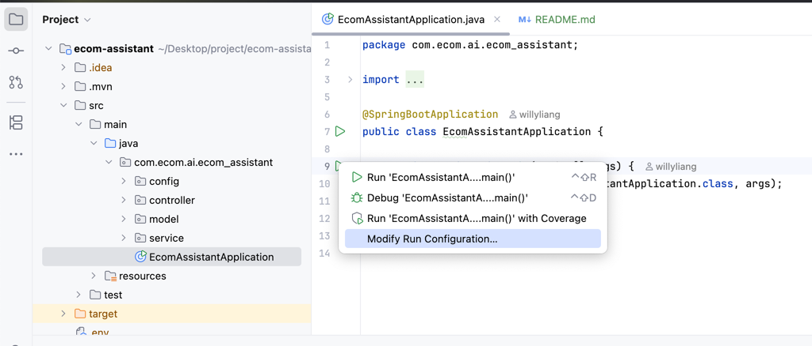

# Spring Boot AI assistant

## 📦 專案架構
| 類別                    | 技術                    |
|-----------------------|-----------------------|
| 語言                    | Java 17               |
| 框架                    | Spring Boot 3.x       |
| ORM                   | Spring Data           | 
| 資料庫                   | Couchbase             |
| Cache server          | Couchbase             |
| Vector store          | Couchbase             |
| 驗證                    | Spring Security + JWT |
| AI 模型推論               | Spring AI             |
| Chat AI provider      | Groq                  |
| Embedding AI provider | OpenAI                |
| 文件                    | OpenAPI               |
| 建置工具                  | Maven                 |

## 🚀 快速啟動
### 1. 建立 `.env` 檔案
在專案根目錄，複製`.env.example`為`.env`：
```
COUCHBASE_CONNECTION_STRINGS=localhost
COUCHBASE_USERNAME=admin
COUCHBASE_PASSWORD=couchbase
COUCHBASE_BUCKET_NAME=ECOM
COUCHBASE_SCOPE_NAME=AI
COUCHBASE_VECTOR_COLLECTION_NAME=document-vector

GROK_API_KEY=
GROK_CHAT_MODEL=meta-llama/llama-4-maverick-17b-128e-instruct

OPENAI_API_KEY=
```

### 2. couchbase set up
```shell
docker run -d \
  --name couchbase-ai \
  --hostname couchbase.local \
  --add-host couchbase.local:127.0.0.1 \
  -p 8091-8097:8091-8097 \
  -p 9123:9123 \
  -p 11210:11210 \
  -p 11280:11280 \
  -p 18091-18097:18091-18097 \
  couchbase:enterprise-7.6.5
```

**run schema/v0.0_init**

**run api service with docker**
```shell
docker run --env-file .env -p 8080:8080 --name ecom-assistant willyliang/ecom-assistant
```


## 開發環境
run with config

| edit conifg                                    | add .env                                                   |
|------------------------------------------------|------------------------------------------------------------|
|  |  |


#### 1. swagger
http://localhost:8080/swagger-ui/index.html


### 2. module
模組間不互相依賴, 如果db entity結構需要共用,
entity還是保留在db module, 另外建立一個class在common,
並使用mapstruct做mapper

|        |                     |
|--------|---------------------|
| 名稱     | 說明                  |
| ai     | ai相關的service        |
| api    | RestApi             |
| common | 共用資源                |
| core   | 核心邏輯, 依賴所有其他模組      |
| db     | db相關entity, service |


### 3. build
#### docker
```shell
docker build -t ecom-assistant .
```

**apple silicon**
**建立並啟用 buildx builder（只需做一次）**
```shell
docker buildx create --name multiarch-builder --use
```

```shell
docker buildx build \
  --platform linux/amd64,linux/arm64 \
  -t willyliang/ecom-assistant:latest \
  .
```