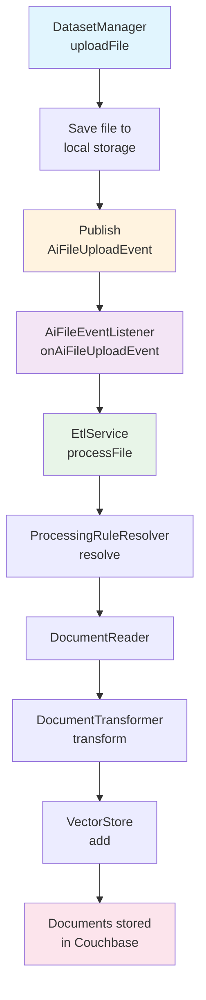

# ETL 服務說明

本文檔詳細說明文件處理 ETL（Extract, Transform, Load）服務的架構、流程和配置。

## 🔄 ETL 處理流程

### 整體架構圖



### 處理步驟詳解

#### 1. 文件上傳階段
**組件**: `DatasetManager.uploadFile`
- **功能**: 文件上傳入口點
- **操作**: 將文件儲存到本地存儲
- **事件**: 發布 `AiFileUploadEvent` 事件

#### 2. 事件監聽階段  
**組件**: `AiFileEventListener.onAiFileUploadEvent`
- **功能**: 非同步監聽文件上傳事件
- **操作**: 觸發 ETL 處理流程
- **優勢**: 解耦上傳和處理邏輯

#### 3. ETL 服務協調
**組件**: `EtlService.processFile`
- **功能**: 核心 ETL 處理服務
- **職責**: 協調整個文件轉換流程
- **流程控制**: 管理處理規則選擇和執行順序

#### 4. 處理規則解析
**組件**: `ProcessingRuleResolver.resolve`
- **功能**: 根據檔案名稱和副檔名選擇對應的處理規則
- **判斷依據**: 檔案名稱開頭、副檔名
- **支援格式**: PDF、CSV、JSON
- **擴展性**: 可動態添加新的文件類型支援

#### 5. 文件讀取階段
**組件**: `DocumentReader`
- **功能**: 將文件轉換為文檔物件
- **實作類型**:
  - `DefaultPagePdfDocumentReader` - PDF 文件處理
  - `DefaultCsvDocumentReader` - CSV 文件處理  
  - `DefaultJsonDocumentReader` - JSON 文件處理

#### 6. 文檔轉換階段
**組件**: `DocumentTransformer`
- **功能**: 進行內容處理和元數據增強
- **轉換器類型**:
  - `DefaultImageContentRemover` - 移除圖片內容
  - `DefaultImageEnricher` - 圖片內容增強
  - `DefaultPdfImageExtractor` - PDF 圖片提取
  - `DefaultSummaryMetadataEnricher` - 摘要元數據增強
  - `DefaultTableOfContentDetector` - 目錄結構檢測
  - `DefaultTokenTextSplitter` - 文本分割器

#### 7. 向量存儲階段
**組件**: `VectorStore.add`
- **功能**: 將處理後的文檔儲存到 Couchbase 向量資料庫
- **操作**: 生成向量嵌入並存儲
- **索引**: 建立向量搜索索引

## 📁 支援的文件格式

### PDF 文件處理
```java
@Component
public class DefaultPagePdfDocumentReader implements EcomDocumentReader {
    // PDF 逐頁讀取和解析
    // 支援圖片提取和文本識別
    // 保留文檔結構和元數據
}
```

**特性**:
- 逐頁解析處理
- 圖片內容提取
- 文本格式保留
- 元數據提取

### CSV 文件處理
```java
@Component  
public class DefaultCsvDocumentReader implements EcomDocumentReader {
    // CSV 結構化數據讀取
    // 欄位映射和類型轉換
    // 批次處理支援
}
```

**特性**:
- 自動欄位檢測
- 數據類型推斷
- 大文件分批處理
- 編碼自動識別

### JSON 文件處理
```java
@Component
public class DefaultJsonDocumentReader implements EcomDocumentReader {
    // JSON 層次結構解析
    // 動態欄位提取
    // 巢狀物件處理
}
```

**特性**:
- 動態結構解析
- 巢狀物件處理
- 陣列數據展開
- 元數據生成

## 🔧 ETL 配置

### 文件處理規則配置
```java
@Getter
@Setter
@Component
@ConfigurationProperties(prefix = "etl.file-processing.default")
public class FileProcessingRuleConfig {
    private String reader = "defaultPagePdfDocumentReader";
    private List<String> transformers = List.of(
        "defaultTokenTextSplitter"
    );
}
```

### ETL 服務配置
```java
@Configuration
public class EtlConfig {
    
    @Bean
    public FileProcessingRule defaultFileProcessingRule(FileProcessingRuleConfig ruleConfig) {
        return FileProcessingRule.builder()
                .name("default")
                .reader(ruleConfig.getReader())
                .transformers(ruleConfig.getTransformers())
                .build();
    }
}
```

### 配置檔案設定

#### 基本配置
```yaml
etl:
  file-processing:
    default:
      reader: "defaultPagePdfDocumentReader"
      transformers:
        - "defaultTokenTextSplitter"
        # - "defaultPdfImageExtractor"    # 可選的圖片提取器
        # - "defaultImageEnricher"        # 可選的圖片增強器
```

#### 進階配置範例（依檔案名稱和副檔名）
```yaml
etl:
  file-processing:
    # PDF 文件處理規則
    pdf-standard:
      reader: "defaultPagePdfDocumentReader"
      transformers:
        - "defaultTokenTextSplitter"
        - "defaultPdfImageExtractor"
    
    # CSV 文件處理規則  
    csv-data:
      reader: "defaultCsvDocumentReader"
      transformers:
        - "defaultTokenTextSplitter"
    
    # JSON 文件處理規則
    json-config:
      reader: "defaultJsonDocumentReader"
      transformers:
        - "defaultTokenTextSplitter"
    
    # 特殊圖片增強處理（檔案名以 "image_" 開頭）
    image-enhanced:
      reader: "defaultPagePdfDocumentReader"
      transformers:
        - "defaultPdfImageExtractor"
        - "defaultImageEnricher"
        - "defaultTokenTextSplitter"
```

### ProcessingRuleResolver 實作範例
```java
@Component
@RequiredArgsConstructor
public class ProcessingRuleResolver {

    private final Map<String, FileProcessingRule> rules;
    private final FileProcessingRule defaultFileProcessingRule;
    
    public FileProcessingRule resolve(FileInfo fileInfo) {
        String fileName = fileInfo.fileName();
        
        // 依檔案名稱開頭判斷
        if (fileName.startsWith("image_")) {
            return rules.getOrDefault("image-enhanced", defaultFileProcessingRule);
        }
        if (fileName.startsWith("manual_")) {
            return rules.getOrDefault("pdf-standard", defaultFileProcessingRule);
        }
        
        // 依副檔名判斷
        if (fileName.toLowerCase().endsWith(".pdf")) {
            return rules.getOrDefault("pdf-standard", defaultFileProcessingRule);
        }
        if (fileName.toLowerCase().endsWith(".csv")) {
            return rules.getOrDefault("csv-data", defaultFileProcessingRule);
        }
        if (fileName.toLowerCase().endsWith(".json")) {
            return rules.getOrDefault("json-config", defaultFileProcessingRule);
        }
        
        // 預設規則
        return defaultFileProcessingRule;
    }
}
```

## 🛠️ 文檔轉換器

### 圖片處理轉換器
- **DefaultImageContentRemover**: 移除不必要的圖片內容
- **DefaultImageEnricher**: 使用 AI 分析圖片並生成描述
- **DefaultPdfImageExtractor**: 從 PDF 中提取圖片

### 文本處理轉換器  
- **DefaultTokenTextSplitter**: 智能文本分割
- **DefaultSummaryMetadataEnricher**: 生成文檔摘要
- **DefaultTableOfContentDetector**: 檢測文檔目錄結構

### 元數據增強器
- **DefaultDatasetInfoEnricher**: 添加數據集關聯信息
- **RawJsonMetadataGenerator**: JSON 原始元數據生成

## 📊 監控和日誌

### 日誌配置
```yaml
logging:
  level:
    com.ecom.ai.ecomassistant.ai.etl: DEBUG
    com.ecom.ai.ecomassistant.ai.service: INFO
```

## 🚨 錯誤處理

### 常見錯誤類型
1. **文件格式不支援**: 檢查文件 MIME 類型
2. **文件過大**: 調整文件大小限制
3. **解析失敗**: 檢查文件完整性
4. **向量化失敗**: 確認 OpenAI API 配置

### 重試機制
```java
@Retryable(value = {EtlProcessingException.class}, maxAttempts = 3)
public ProcessingResult processFile(FileInfo fileInfo) {
    // ETL 處理邏輯
}
```

## 🔄 擴展 ETL 服務

### 添加新的文件類型支援
1. 實作 `EcomDocumentReader` 介面
2. 創建對應的 `FileProcessingRule`
3. 註冊到 `ProcessingRuleResolver`

### 自定義文檔轉換器
1. 實作 `EcomDocumentTransformer` 介面
2. 添加到處理規則配置
3. 配置轉換器執行順序

## 📋 相關文檔
- [主要 README](../../README.md)
- [RAG 檢索增強](rag.md)
- [認證授權系統](../auth.md)
- [Docker 部署](../docker-deployment.md)
- [資料庫設計](../setup_database.md)