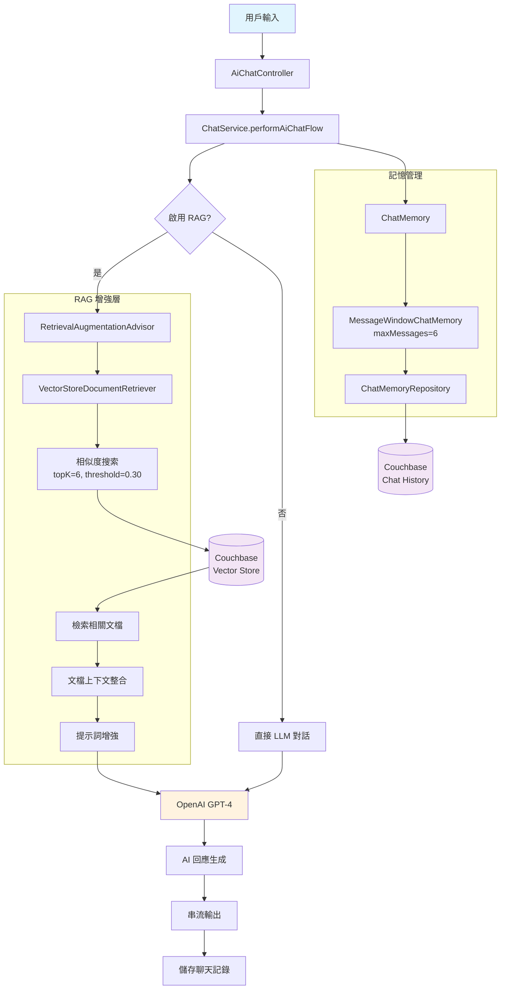
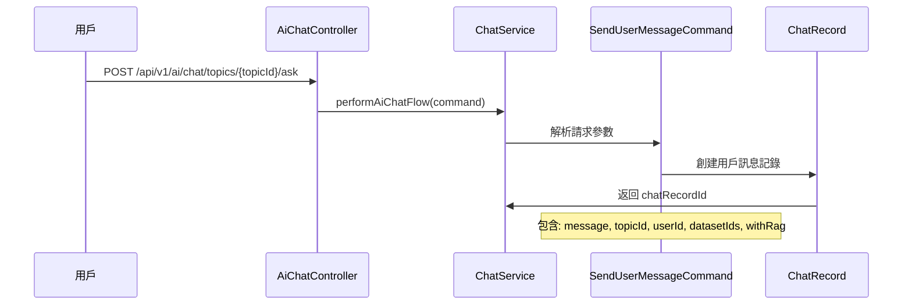
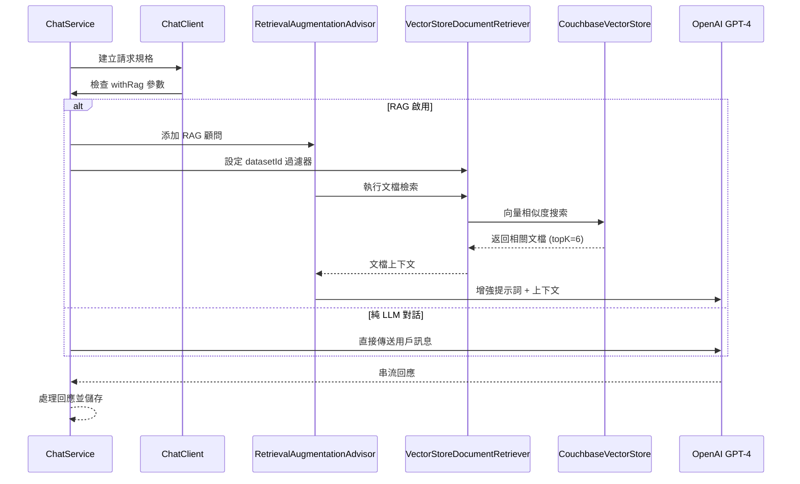
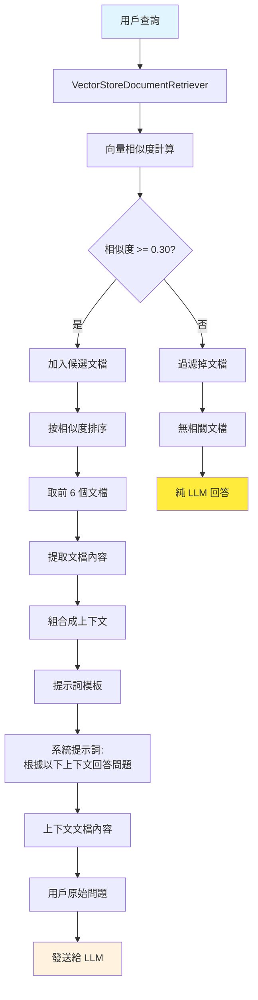

# RAG 檢索增強生成系統

本文檔詳細說明系統中 RAG（Retrieval-Augmented Generation）檢索增強生成的架構、流程和實作。

## 🔍 RAG 系統概述

RAG 系統結合了檢索（Retrieval）和生成（Generation）兩個關鍵技術，通過檢索相關文檔來增強 AI 的回答能力，提供更準確、更有根據的回應。

### 核心技術組件
- **Spring AI**: RAG 框架與顧問系統
- **Couchbase Vector Store**: 向量數據庫存儲
- **OpenAI GPT-4**: 大語言模型
- **Document Retriever**: 文檔檢索器
- **Chat Memory**: 對話記憶管理

## 🏗️ RAG 系統架構

### 整體架構圖



## 🔄 RAG 處理流程

### 1. 用戶請求處理



**關鍵組件:**
- `AiChatController:68` - SSE 串流端點
- `ChatService:45` - RAG 流程入口
- `SendUserMessageCommand` - 請求命令物件

### 2. RAG 檢索流程



**關鍵配置:**
- **相似度閾值**: 0.30
- **檢索文檔數量**: topK = 6
- **過濾條件**: `datasetId IN [dataset1, dataset2, ...]`

### 3. 上下文處理流程



## ⚙️ 配置與組件

### RAG 配置 (AiConfig)

```java
@Bean
RetrievalAugmentationAdvisor retrievalAugmentationAdvisor(
    ChatClient.Builder chatClientBuilder, 
    VectorStore vectorStore
) {
    return RetrievalAugmentationAdvisor.builder()
        .documentRetriever(VectorStoreDocumentRetriever.builder()
            .similarityThreshold(0.30)  // 相似度閾值
            .topK(6)                    // 檢索文檔數量
            .vectorStore(vectorStore)    // 向量存儲
            .build())
        .build();
}
```

### Chat Memory 配置

```java
@Bean
ChatClient chatClient(ChatClient.Builder builder, ChatMemoryRepository repository) {
    ChatMemory chatMemory = MessageWindowChatMemory.builder()
        .chatMemoryRepository(repository)
        .maxMessages(6)  // 記憶最近 6 條訊息
        .build();
    
    return builder
        .defaultAdvisors(
            PromptChatMemoryAdvisor.builder(chatMemory).build()
        )
        .build();
}
```

### 向量檢索配置

| 參數 | 值 | 說明 |
|------|-----|------|
| `similarityThreshold` | 0.30 | 文檔相似度閾值 |
| `topK` | 6 | 檢索文檔數量上限 |
| `temperature` | 0.0 | LLM 創造性參數 |
| `maxMessages` | 6 | 對話記憶長度 |

## 🎯 RAG 使用流程

### 1. 啟用 RAG 檢索

```bash
curl -X POST http://localhost:8080/api/v1/ai/chat/topics/{topicId}/ask \
  -H "Content-Type: application/json" \
  -H "Authorization: Bearer YOUR_JWT_TOKEN" \
  -H "Accept: text/event-stream" \
  -d '{
    "message": "請介紹產品特色",
    "datasetIds": ["dataset1", "dataset2"],
    "withRag": true
  }'
```

### 2. 不使用 RAG (純 LLM)

```bash
curl -X POST http://localhost:8080/api/v1/ai/chat/topics/{topicId}/ask \
  -H "Content-Type: application/json" \
  -H "Authorization: Bearer YOUR_JWT_TOKEN" \
  -H "Accept: text/event-stream" \
  -d '{
    "message": "請介紹產品特色",
    "withRag": false
  }'
```

### 3. SSE 回應格式

```
data: chatId:01ARZ3NDEKTSV4RRFFQ69G5FAV

data: context:doc1,doc2,doc3

data: 根據您提供的文檔

data: ，我可以介紹以下產品特色

data: ：1. 高品質材料...

data: [DONE]
```

**回應格式說明:**
- `chatId:xxx` - 聊天記錄 ID
- `context:xxx` - 檢索到的文檔 ID 列表
- 後續為 AI 回應內容串流

## 🔍 檢索策略

### 文檔過濾機制

```java
// 根據數據集 ID 過濾
String datasetIdString = datasetIds.stream()
    .map(s -> String.format("'%s'", s))
    .collect(Collectors.joining(", "));

String filterExpression = String.format("datasetId IN [%s]", datasetIdString);
```

### 相似度計算

1. **向量嵌入**: 使用 OpenAI text-embedding-ada-002 模型
2. **相似度計算**: 餘弦相似度 (Cosine Similarity)
3. **閾值過濾**: 相似度 >= 0.30 的文檔
4. **排序選擇**: 按相似度降序，取前 6 個

### 上下文整合

```java
protected String getAndSetChatContext(Signal<? extends ChatClientResponse> signal) {
    return Optional.ofNullable(signal.hasValue() ? signal.get() : null)
        .map(ChatClientResponse::context)
        .map(ctx -> ctx.get(RetrievalAugmentationAdvisor.DOCUMENT_CONTEXT))
        .filter(obj -> obj instanceof List<?>)
        .map(obj -> {
            List<?> list = (List<?>) obj;
            return list.stream()
                .filter(item -> item instanceof Document)
                .map(item -> ((Document) item).getId())
                .collect(Collectors.toList());
        })
        .map(ids -> String.join(",", ids))
        .orElse(null);
}
```

## 📊 效能優化

### 向量搜索優化

1. **索引策略**: Couchbase 向量索引優化
2. **批次檢索**: 支援多數據集並行檢索
3. **快取機制**: 熱點查詢結果快取
4. **異步處理**: 非阻塞 I/O 模式

### 記憶管理優化

1. **滑動窗口**: 保留最近 6 條對話記錄
2. **壓縮策略**: 長對話自動摘要
3. **分散存儲**: 基於主題 ID 的記憶分片

## 🚨 故障排除

### 常見問題

#### 1. RAG 檢索無結果
- **檢查**: 數據集 ID 是否正確
- **檢查**: 向量數據是否已建立索引
- **調整**: 降低相似度閾值 (如 0.20)

#### 2. 回應速度慢
- **檢查**: Couchbase 向量索引性能
- **檢查**: OpenAI API 響應時間
- **優化**: 減少 topK 數量

#### 3. 上下文不相關
- **檢查**: 文檔向量化品質
- **調整**: 提高相似度閾值
- **優化**: 改進文檔分段策略

### 調試配置

```java
// 啟用詳細日誌
@Bean
ChatClient chatClient(ChatClient.Builder builder) {
    return builder
        .defaultAdvisors(
            SimpleLoggerAdvisor.builder()
                .logFullMessage(true)
                .build()
        )
        .build();
}
```

## 🔄 擴展 RAG 系統

### 添加新的檢索策略

1. 實作自定義 `DocumentRetriever`
2. 配置檢索參數
3. 註冊到 `RetrievalAugmentationAdvisor`

### 自定義提示詞模板

1. 實作 `PromptTemplate`
2. 配置上下文整合邏輯
3. 整合到 RAG 流程

### 多模態 RAG

1. 支援圖片向量化
2. 多模態相似度計算
3. 整合文本和圖片上下文

## 📋 相關文檔

- [主要 README](../../README.md)
- [ETL 服務](etl-service.md)
- [認證授權系統](../auth.md)
- [Docker 部署](../docker-deployment.md)