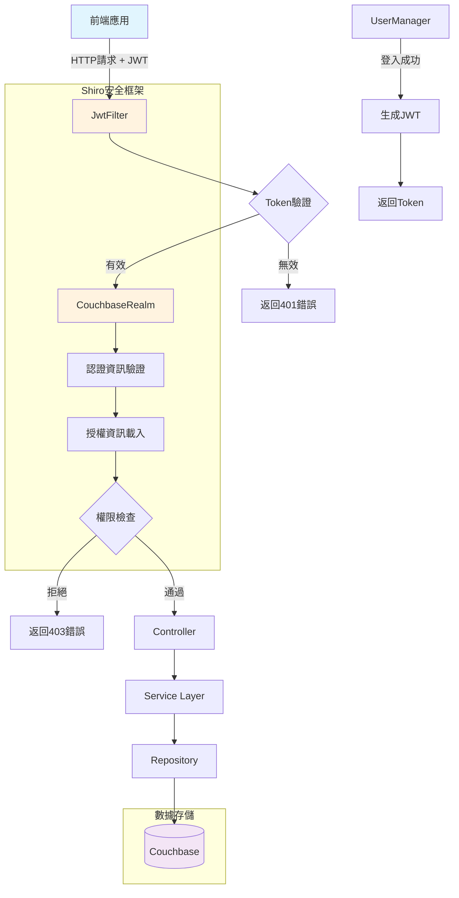
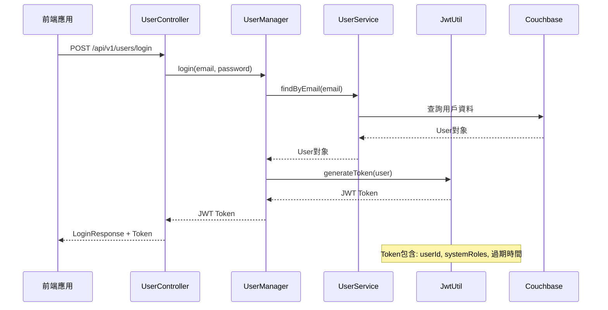
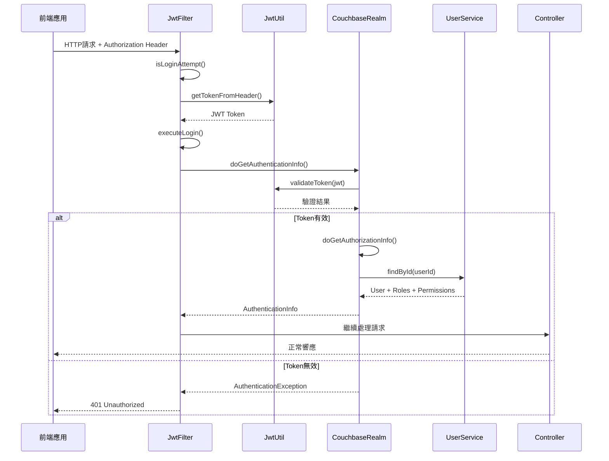
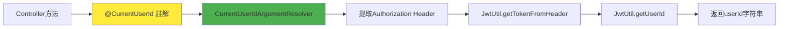
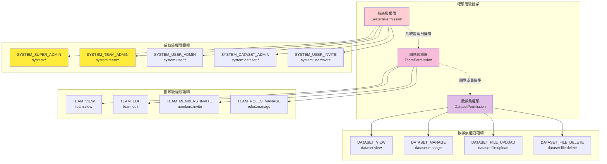
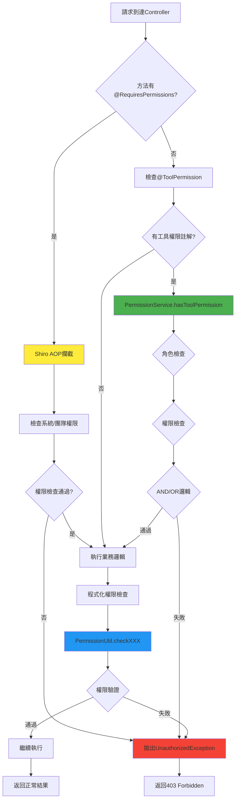
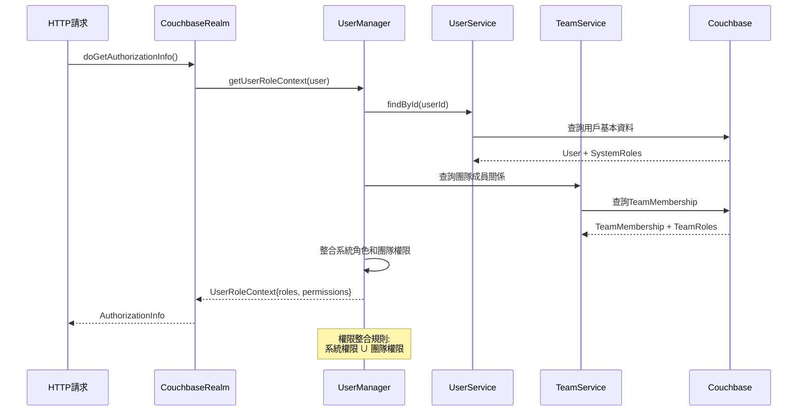
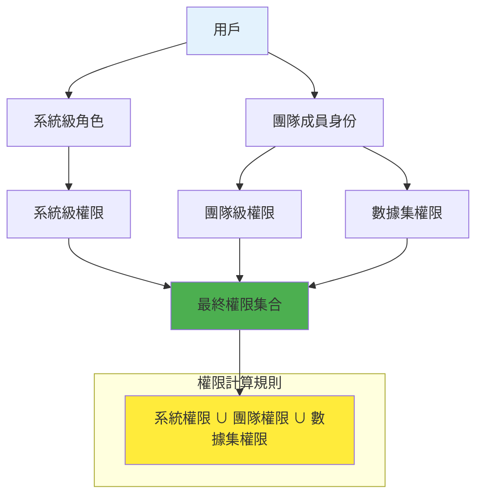

# 認證授權系統文件

## 系統架構概述

本專案採用基於 **Apache Shiro** 和 **JWT** 的分散式認證授權架構，結合團隊制和權限系統，提供細粒度的存取控制。

### 核心技術組件
- **Apache Shiro**: 認證、授權、會話管理框架
- **JWT (JSON Web Token)**: 無狀態認證令牌
- **Couchbase**: 用戶資料和權限資料存儲
- **Spring Security**: 密碼加密（BCrypt）

### 整體架構圖



## 認證流程

### 1. 用戶登入流程



**關鍵組件:**
- `JwtUtil:25` - JWT 令牌生成
- `UserManager` - 登入業務邏輯

### 2. 請求認證流程



**關鍵組件:**
- `JwtFilter:21` - 攔截請求並驗證 JWT
- `CouchbaseRealm:35` - Shiro Realm 實作，處理認證邏輯
- `ShiroConfig:31` - Shiro 配置和過濾鏈定義

### 3. 當前用戶解析

透過 `@CurrentUserId` 註解自動解析當前用戶ID：



```java
@GetMapping("/me")
public UserDetailDto me(@CurrentUserId String userId) {
    return userManager.getUserDetail(userId);
}
```

**實作機制:**
- `CurrentUserIdArgumentResolver:14` - Spring MVC 參數解析器
- 從 JWT Token 中提取 userId: `JwtUtil.getUserId(token)`

## 授權系統

### 權限分級架構



#### 1. 系統級權限 (SystemPermission)
管理整個系統的核心功能，具有最高優先級：

- `SYSTEM_SUPER_ADMIN("system:*")` - 系統超級管理權限
- `SYSTEM_TEAM_ADMIN("system:team:*")` - 團隊管理全部權限  
- `SYSTEM_USER_ADMIN("system:user:*")` - 使用者全部權限
- `SYSTEM_DATASET_ADMIN("system:dataset:*")` - 知識庫管理員
- `SYSTEM_USER_INVITE("system:user:invite")` - 邀請使用者
- `SYSTEM_TEAM_MANAGE("system:team:manage")` - 管理團隊

#### 2. 團隊級權限 (TeamPermission)
團隊內部管理權限，作用範圍限定在特定團隊：

- `TEAM_VIEW("team:view")` - 檢視團隊資訊
- `TEAM_EDIT("team:edit")` - 編輯團隊
- `TEAM_MEMBERS_INVITE("members:invite")` - 邀請團隊成員
- `TEAM_ROLES_MANAGE("roles:manage")` - 管理團隊角色

**團隊權限格式:** `team:{teamId}:{permission_code}`

#### 3. 數據集權限 (DatasetPermission)
知識庫相關操作權限，提供細粒度的資料存取控制：

- `DATASET_VIEW("dataset:view")` - 查詢知識庫
- `DATASET_MANAGE("dataset:manage")` - 知識庫基本訊息管理
- `DATASET_FILE_UPLOAD("dataset:file:upload")` - 上傳檔案
- `DATASET_FILE_DELETE("dataset:file:delete")` - 刪除其他人檔案

### 權限檢查機制

#### 授權流程圖



#### 1. 註解式權限檢查

```java
@RequiresPermissions({"system:user:invite"})
public UserDto inviteUser(@RequestBody UserInviteRequest request) {
    // 方法實作
}
```

#### 2. 程式化權限檢查

```java
// 檢查單一權限
PermissionUtil.checkAnyPermission("system:user:view");

// 檢查多個權限 (OR 邏輯)  
PermissionUtil.checkAnyPermission(Set.of("perm1", "perm2"));

// 檢查多個權限 (AND 邏輯)
PermissionUtil.checkAllPermission(Set.of("perm1", "perm2"));
```

#### 3. 工具權限檢查

對於 AI 工具系統，支援動態權限檢查：

```java
@ToolPermission(
    roles = {"admin"},
    permissions = {"tool:execute"}, 
    roleLogic = LogicType.OR,
    permissionLogic = LogicType.AND
)
```

**實作位置:** `PermissionService:14`

## 用戶角色體系

### 角色解析流程



**實作細節:**
- `CouchbaseRealm:57` - 取得用戶角色和權限
- `UserManager.getUserRoleContext()` - 整合系統角色和團隊權限

### 權限繼承規則



1. **系統級角色** → 系統級權限
2. **團隊角色** → 團隊級權限 + 數據集權限  
3. **最終權限** = 系統權限 ∪ 團隊權限 ∪ 數據集權限

## 配置與安全

### Shiro 配置 (ShiroConfig)

```java
// 公開路徑 (無需認證)
chain.addPathDefinition("/swagger-ui/**", "anon");
chain.addPathDefinition("/**/users/login", "anon");
chain.addPathDefinition("/**/users/activate", "anon");

// API 路徑 (需要 JWT 認證)
chain.addPathDefinition("/**", "jwt");
```

### JWT 配置

```java
private static final String SECRET = "your-256-bit-secret"; // 需要配置為環境變數
private static final long EXPIRATION = 3600_000; // 1小時
```

**安全注意事項:**
- JWT 密鑰應存儲在環境變數中
- Token 過期時間可根據安全需求調整
- 支援 CORS 跨域請求

## 關鍵檔案說明

### 認證相關
- `ShiroConfig.java` - Shiro 主配置
- `JwtFilter.java` - JWT 認證過濾器
- `CouchbaseRealm.java` - Shiro Realm 實作
- `JwtUtil.java` - JWT 工具類

### 授權相關
- `PermissionDefinition.java` - 權限定義結構
- `PermissionRegistry.java` - 權限註冊表
- `SystemPermission.java` - 系統級權限枚舉
- `TeamPermission.java` - 團隊級權限枚舉
- `DatasetPermission.java` - 數據集權限枚舉
- `PermissionUtil.java` - 權限檢查工具
- `PermissionService.java` - 工具權限服務

### 用戶管理
- `UserManager.java` - 用戶業務邏輯
- `CurrentUserIdArgumentResolver.java` - 當前用戶ID解析器
- `CurrentUserId.java` - 當前用戶ID註解

## 最佳實踐

### 1. 權限設計原則
- **最小權限原則**: 用戶只擁有完成任務所需的最小權限
- **權限分層**: 系統 → 團隊 → 數據集的層次化權限結構
- **職責分離**: 不同類型的操作使用不同的權限控制

### 2. 安全配置建議
- JWT 密鑰使用至少 256 位的強隨機字符串
- 定期輪換 JWT 密鑰
- 合理設置 Token 過期時間
- 在生產環境中關閉詳細的錯誤信息

### 3. 權限檢查建議
- 在控制器層使用 `@RequiresPermissions` 註解
- 在服務層使用 `PermissionUtil` 進行程式化檢查
- 對於複雜的權限邏輯，優先使用專用的權限服務

### 4. 監控和審計
- 記錄關鍵的認證和授權事件
- 監控異常的權限檢查失敗
- 定期審查用戶權限分配